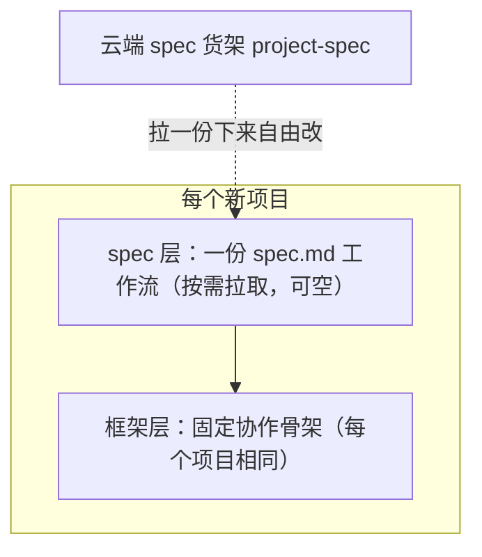

# Project-Template（通用项目模板）

这是一套**开箱即用、面向「人 + AI 助手协作」的通用项目模板**。它把人与 AI
协作开发的骨架和规范固化下来：你说一句话，AI 助手就能按模板初始化一个新
项目；之后任何 AI 助手接手，哪怕没有上一次的对话记录，**冷启动**（新会话
没有历史对话时，靠读磁盘上的文件重建上下文的过程）读一遍项目里的
`AGENTS.md` 就能恢复项目全貌——不绑定某个特定 AI 工具，也不依赖历史对话。

## 核心理念：结构是框架，工作流是 spec

模板分上下两层，各管一件事：

- **框架**是每个项目都一样的固定骨架：协作总纲、任务板、AI 助手记忆、
  协作活状态区（`process/`：常驻的任务板与助手记忆，加上随手笔记、`review`
  验收件等用完即清的临时件）、工作区与历史归档目录、git 约定。它回答「状态
  放在哪、会话中断怎么交接、什么操作必须先找人确认」，保证一个项目哪怕什么
  都不配，也能最低限度运转。
- **spec** 是具体工作流的声明式编排：不同类型的项目有不同的流程和规范，
  这些由一份 `spec.md`（+ 产出骨架 `assets/`）声明，需要时从配套的云端
  货架按需拉取、拉下来自由改。不装 spec，项目就以框架形态轻装运转。

两层的关系、以及本仓与配套云端货架的分工如下图：框架是每个新项目自带
的底座，spec 叠加在框架上、可装可不装；spec 的货架在云端，项目里用到
的都是从那里拉来、之后归项目自由改的副本。



## 仓库里的技能

| 技能 | 干什么 | 何时生效 |
| --- | --- | --- |
| **init-project** | 兼两个用途：① 把任意空文件夹初始化成符合模板规范的新项目（复制骨架、初始化 git 并首次提交）；② 作为项目外对话的通用行为基线——指向模板本体 `AGENTS.md`「五、宪章」节与其 `spec/constitution.md`「宪章」节的 6 条（重事实、先对齐再动手、操作风险分级、删除走可恢复路径、回读校验、书写规范），只指向不复制、杜绝漂移 | 适用于所有非纯聊天的对话：要开新项目时走①；对话不属于任何项目、且非纯聊天时走②；一旦进入某个项目，就以那个项目自己的 `AGENTS.md` 为准 |

## 它能帮你解决什么问题

- **开新项目不再从零搭骨架**：协作总纲、任务板、会话协议、历史归档
  全部自带，AI 助手一条指令就能搭好骨架并完成首次提交。
- **可以随时更换 Agent**：AI 的上下文是易失内存，`process/` 里的任务板、
  助手记忆等活状态就是落在磁盘上的当前状态——会话中断、换新对话、换个
  AI 工具，状态都不丢。
- **工作流按需装配**：需要文档体系和流程编排时，从云端货架拉取一份
  spec；不需要就不装，框架本身不绑死任何工作流。
- **该确认的确认、该自动的自动**：创建 git 仓库、批量落盘、发布、永久
  删除这类不可逆操作，AI 助手会先展示方案、征得同意再动手；`.gitignore`
  预置常见密钥文件名模式，宁可误伤不可漏收。
- **一套规范装给所有 AI 助手**：技能可以复制到多个 AI 助手的用户级
  技能目录，让它们遵循同一套规则。

## 快速开始

**第 0 步：先获取本仓**——`git clone https://github.com/The-Daybreaker/Project-Template`
（或直接下载 ZIP），下面两种方式都基于仓里的文件。

### 方式一：安装技能使用（推荐）

把 `init-project/` 整个目录复制到 AI 助手的用户级技能目录（例如 Codex 是
`~/.codex/skills/`，其他助手见各自文档）。之后对助手说：

> 「用 init-project 技能把 <目标目录> 初始化为一个新项目」

它会按固定清单执行：先和你确认目标目录与落盘方案 → 复制模板骨架 →
初始化 git 并完成首次提交 → 逐项回读校验。初始化会创建 git 仓库、批量落盘，属于高风险操作，所以它
一定会先确认再动手。

把 `init-project/` 装到每个常用 AI 助手：它既能在你要开新项目时初始化，也
作为项目外对话的行为基线（指向模板宪章 6 条，正文在 `spec/constitution.md`），进入具体项目后自动让位于
项目自己的 `AGENTS.md`。

### 方式二：直接运行脚本或手动复制

不想走技能，也可以直接运行仓库里的 Python 脚本（Python 3.9+，仅用标准
库）：

```bash
# 复制模板 + 初始化 git 并完成首次提交
python init-project/scripts/init_project.py <目标目录>

# 可选：指定 git 默认分支（不指定时默认 main）
python init-project/scripts/init_project.py <目标目录> --branch main

# 只复制文件，不建 git
python init-project/scripts/init_project.py <目标目录> --no-git
```

参数逐项说明（与脚本 `--help` 一致）：

| 参数 | 作用 | 默认 |
| --- | --- | --- |
| `target`（位置参数） | 目标项目目录；已有文件一律跳过、绝不覆盖；目录已含 `.git` 时报错退出、不做任何 git 操作 | 必填 |
| `--branch` | 首次提交所在的 git 默认分支 | `main` |
| `--no-git` | 只复制文件，跳过 git 初始化与首次提交 | 关闭 |

复制时会自动排除 `_trash/`、`.git/`、`__pycache__/`；目标目录里已有的
文件一律跳过、绝不覆盖（非空目录会先警告并列出已有内容）。

也可以完全手动：把 `init-project/assets/project-template/` 下的内容复制
到新项目目录（同样跳过上述三个目录），第一次对话让 AI 助手冷启动即可。

### 初始化之后

1. 第一次对话时，AI 助手会自动先读项目根的 `AGENTS.md`，按冷启动链恢复
   上下文，这时和它对齐项目背景与目标；
2. 需要文档体系或工作流时，按下方「配套仓库」一节拉取合适的 spec，
   也可以自己写一份；不装 spec 也能正常开工；
3. 配置远端仓库并推送由你确认后进行，AI 助手不会擅自推送。

## 目录结构

```text
Project-Template/
├── README.md                     # 本文件：门面与使用说明（自洽，读完即可上手）
├── CHANGELOG.md                  # 发布版本变更记录
├── .gitattributes / .gitignore   # 行尾统一（仓内 LF）与忽略规则
└── init-project/                 # 通用项目模板技能（项目初始化 + 项目外行为基线）
    ├── SKILL.md                  #   技能说明（两种用途 + 执行清单）
    ├── scripts/init_project.py   #   确定性复制与初始化脚本
    └── assets/project-template/  #   模板本体（全仓只此一份）
        ├── AGENTS.md             #   协作总纲：冷启动入口 + 会话协议 + 宪章强指针（规范正文在 spec/constitution.md）
        ├── README.md             #   随新项目分发的使用手册（含「写给用户」提醒）
        ├── CHANGELOG.md          #   模板变更记录
        ├── .editorconfig / .gitattributes / .gitignore  # 编辑器约定、行尾与忽略规则
        ├── context/              #   项目上下文文档（装什么由 spec 决定，默认空）
        ├── process/              #   协作活状态区：任务板 + 助手记忆 + 笔记/review 等临时件
        ├── workspace/            #   干活产物 + 发布层；结构由 spec / 项目定（如 src / dist）
        ├── archive/              #   历史归档（只追加）
        └── spec/                 #   机制说明书 AGENTS.md + constitution.md 规范宪章；spec 工作流内容按需拉取
```

模板里的空目录（如 `context/`）靠 `.gitkeep` 占位才能进入 git；
`.githooks/`、快捷方式等本地开发件不入库，故不在树中。

## 配套仓库：云端 spec 货架

spec 不放在本仓，统一存放在配套公开仓
**`github.com/The-Daybreaker/project-spec`**（云端 spec 货架）。一个 spec
就是**一份 `spec.md` 主干 + 一个同级 `assets/`（产出文档骨架）**：
`spec.md` 声明这套工作流管什么场景、有哪几个阶段、阶段怎么依赖、设几档
入口、哪里设检查点，以及每个阶段的产出落点、运行过程与规范边界；
`assets/` 放各阶段产出文档的参考骨架，`spec.md` 按需指向它。

spec 是高度定制化的东西，拉进项目后大概率要按项目情况改，所以货架
**不做只读锁定、也没有防漂移校验**——拉一份下来就是你的，自由改（本地
演进由 git 记录）。

- **有哪些 spec、各管什么场景**，直接看该仓的 `specs/` 目录——每份
  `spec.md` 开头就写明场景与版本；本 README 不复制清单，免得两处记账、
  过时。
- **拉一份 spec**：浏览 `specs/` 选定 → clone 云端仓（或下载）→ 把
  `specs/<id>/` 里的 `spec.md` + `assets/` 复制进项目的 `spec/<id>/` →
  之后自由改。
- **造 / 改 spec 的结构**：把云端 `build/` 拉到项目 `spec/build/`，按
  `build.md` 和 `spec-template/` 母版写。

这套机制的说明书随模板出厂，就在新项目的 `spec/AGENTS.md`（讲 spec 是什么、
怎么拉、怎么读）。
