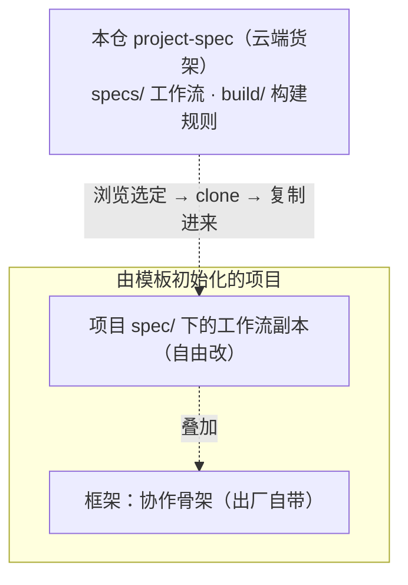

# project-spec — 云端 spec 货架

本仓是 [Project-Template 通用项目模板](https://github.com/The-Daybreaker/Project-Template)
的配套公开仓。如果说模板提供的是**每个项目都一样的协作骨架**（任务板、
AI 记忆、冷启动协议、行为宪章），本仓提供的就是**按需取用的工作流**：
做软件有做软件的流程，开发 skill 有开发 skill 的流程，这些流程统称
spec，统一摆在这个「货架」上供浏览、取用。

## 为什么工作流要单独成仓

框架和工作流的变化频率完全不同：协作骨架追求稳定、每个项目通用；
工作流因项目类型而异、高频演进，而且拉进具体项目后几乎一定要按项目
情况改。所以模板不预置任何工作流，本仓也**只是货架**——不做只读
锁定、不做防漂移校验、不要求保持同步：**拉一份下来就是你的，自由
改**，本地演进交给 git 记录。

## spec 是什么

一个 spec = **一份 `spec.md` 主干 + 一个同级 `assets/`（产出文档
骨架）**：

- **`spec.md`**：这套工作流的全部内容，一份文档读完就懂整套流程——
  管什么场景、分哪几个阶段、阶段之间怎么依赖、设几档入口（缩放旋钮）、
  哪里设检查点，以及每个阶段的产出落点、运行过程与规范边界。
- **`assets/`**：各阶段产出文档的参考骨架（如愿景、方案、PRD、测试
  用例、决策记录的模板），`spec.md` 按需指向它们。

举个具体例子。货架上的 `software-dev`（软件开发）spec 把工作切成
8 个阶段：`vision（愿景与排期）→ design（方案）/ prd（当期需求）→
development（开发）→ test（测试）→ audit（审计）→ release（收口）`，
其中 `adr（决策记录）` 横切全局；同时设了三档入口——改个错别字只走
development，做个小功能走 prd + development + test，完整一期才走
全流程。这就是「简单的事不背重流程，复杂的事不漏环节」。

`spec.md` 内部是固定结构：头部（场景 + 版本）→ §一 这套工作流
（阶段链）→ §二 依赖全景 · 入口 · 检查点 → §三 各阶段（每阶段写清
产出落点 / 运行过程 / 规范边界）。这是「渐进披露」：主文档保持精炼
当路标，骨架作为附件到了对应阶段才读，不把所有东西塞进一个文件。

## 货架上有什么

| 路径 | 是什么 |
| --- | --- |
| `specs/` | spec 货架：每个 spec 一个目录，内含 `spec.md` + `assets/` + `CHANGELOG.md` |
| `build/` | 构建规则：`build.md`（怎么写一份 spec.md）+ `spec-template/`（spec.md 骨架母版）；默认不读，只有造 / 改 spec 时才拉 |

**现有哪些 spec、各自管什么场景、什么版本，直接浏览 `specs/` 目录
即可**——每份 `spec.md` 开头就自报场景与版本。本 README 不复制清单，
免得两处记账、清单过时。

## 怎么消费本仓

日常干活不在本仓里进行，消费动作发生在**由 Project-Template 初始化
的项目**中。模板出厂时，项目的 `spec/` 目录已自带机制说明书
`AGENTS.md`（讲 spec 是什么、怎么拉、怎么读）。分两种场景：

### 1. 用现成工作流（拉一份 spec）

1. 浏览 `specs/` 选定一个 spec，读它 `spec.md` 开头确认场景合适；
2. clone 本仓到临时目录（或直接下载）；
3. 把 `specs/<id>/` 里的 `spec.md` + `assets/` 复制进项目的
   `spec/<id>/`（`CHANGELOG.md` 是货架的版本历史，可不带——项目
   本地以 git 为准）；
4. 之后这份 spec 归项目所有，按项目情况自由改。

### 2. 造 / 改 spec

把本仓 `build/` 拉到项目的 `spec/build/`，按 `build.md` 的规则和
`spec-template/` 母版写：复制母版 → 写清头部与三段式正文（工作流 /
依赖全景·入口·检查点 / 各阶段）→ 补 `assets/` 骨架与 CHANGELOG。
造好的内容可以回流本仓，成为货架上的新版本。

spec 机制的完整说明书随模板出厂、不在本仓（本仓只放 spec 内容
本身）；在项目里读 `spec/AGENTS.md`。

## 版本约定

每个 spec 的版本写在它 `spec.md` 顶部，变更历史记在同目录
`CHANGELOG.md`，遵循语义化版本（SemVer）；`build/` 的版本写在
`build.md` 顶部。spec 拉进项目后归项目自由改，本仓的版本只标
「货架上这是哪一版」，供日后对照升级。
