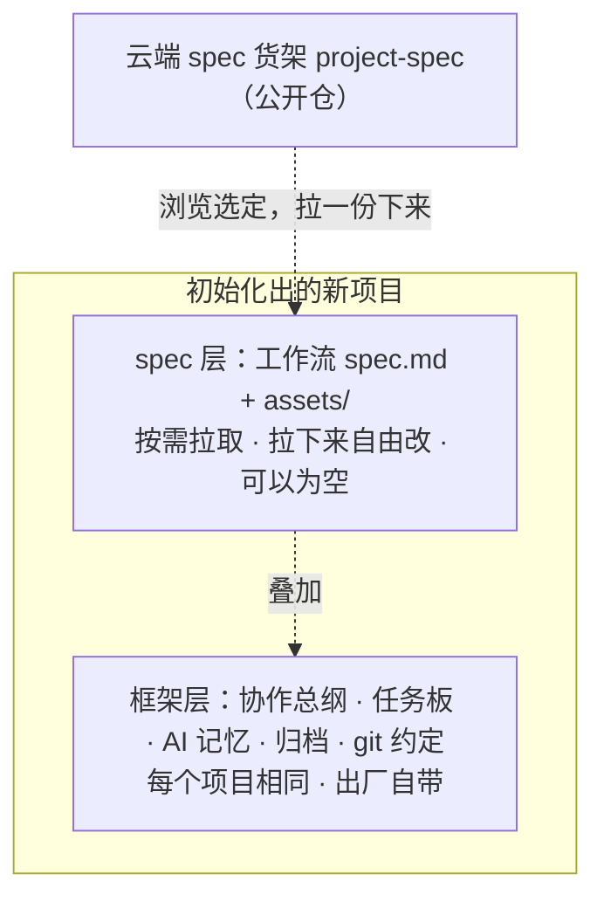

# Project-Template（通用项目模板）

一套**开箱即用、面向「人 + AI 助手协作开发」的通用项目模板**：你说一句话，
AI 助手就把协作骨架搭好；此后任何 AI 助手接手——哪怕没有上一次的对话记录、
哪怕换了一家 AI 工具——按固定顺序读一遍项目里的文件，就能恢复项目全貌、
无缝接着干。全部产物只是 Markdown 与 git，不绑定编程语言，也不绑定任何
AI 厂商。

## 你是不是也遇到过这些问题

- **AI 的记忆只活在对话里**：对话一关、上下文一压缩，项目进行到哪、定过
  什么决策全丢了；换个 AI 工具，更是要从头交代一遍背景。
- **每个新项目都要重新立规矩**：任务记在哪、决策记在哪、什么操作必须先
  问人、历史文件怎么归档……每次口头交代一遍，换个 AI 还得再交代一遍。
- **一套流程套不住所有项目**：做软件要走「需求 → 方案 → 开发 → 测试 →
  发布」，写个小工具却根本不需要这么重；流程写死了僵化，完全不写又乱。
- **开发过程想被 git 留痕，却不想发到 GitHub**：讨论记录、任务板、决策
  过程明明是宝贵资产，想纳入版本管理；可公开发布时，又只希望别人看到
  干净的产物。
- **AI 协作的那些「事故」**：需求没对齐就一路干完导致返工、发布删除之类
  不可逆操作先斩后奏、误删文件找不回来、提示「写入成功」其实没落盘、
  同一份规范抄两处、改了一处忘改另一处。

如果你中了任何一条，这套模板就是为你准备的。

## 设计理念

### 1. 磁盘即记忆：开始 = 读盘，检查点 = 写盘

AI 的对话上下文像内存，断电即失；项目里的文件像硬盘，持久可靠。模板把
「当前状态」全部落在磁盘：`process/task.md` 是任务板（进行中 / 下一步 /
阻塞），`process/memory.md` 是 AI 自己的记忆（踩过的坑、验证过的判断）。

协作协议不赌「会话正常关闭」——聊天窗口没有可靠的关闭事件，谁也保证不了
对话不会戛然而止。规矩反过来定：**任务状态一变就写盘**。于是任何时候
中断，下次开工按固定顺序「读盘」就能恢复全貌，这就是**冷启动**：


### 2. 结构是框架，工作流是 spec

模板分上下两层，各管一件事：

- **框架**是每个项目都一样的固定骨架：协作总纲、任务板、AI 记忆、历史
  归档、工作区、git 约定。它回答「状态放在哪、会话中断怎么交接、什么
  操作必须先找人确认」——哪怕项目什么流程都不配，也能最低限度运转。
- **spec** 是某一类工作的具体流程：分几个阶段、阶段之间怎么依赖、每个
  阶段产出什么，由一份 `spec.md`（加上产出骨架 `assets/`）声明，需要时
  从配套的云端货架按需拉取、拉下来自由改。

框架是底座、每个新项目自带；spec 叠加在框架上、可装可不装；货架在云端，
项目里用到的都是从货架拉来、之后归项目自由改的副本：



### 3. 流程与宪章分开

易变的和稳定的分开存放，各有各的家：

| 文件 | 角色 | 谁维护 | 变化频率 |
| --- | --- | --- | --- |
| `spec/<id>/spec.md` | **流程**：这类活儿分几步、每步怎么走 | 项目自由改、可换 | 因项目而异，高频演进 |
| `spec/constitution.md` | **宪章**：任何会话都遵守的行为规范 | 用户本人维护 | 少数、稳定 |
| `AGENTS.md` | **协作协议**：目录地图、读盘写盘规则 | agent 按机制维护 | 跨项目通用 |

流程再怎么换，宪章不动；想增删自己的协作规矩，只改宪章这一个文件，
不用担心被流程调整冲掉。

### 4. 协作层与发布层分离

这是模板作者从自身痛点出发做的设计：个人开发时，希望开发期的一切
（讨论、任务板、决策、草稿）都被 git 跟踪、随时核对回溯；但公开发布时，
又只想发布干净的产物。

如果项目根目录就是发布仓，过程文件要么被迫公开，要么写进 `.gitignore`、
从此失去版本历史——两头都难受。模板的解法是**用目录结构把两层物理分开**：

- **根目录是协作层**，专为「人与 AI 交流」打造：任务板、AI 记忆、上下文
  文档、规范都在这里，被项目自己的 git 跟踪，**默认不对外发布**；
- **`workspace/` 是干活与发布层**：代码和产物落在这里，对外发布的是它；
  用嵌套的独立 git 仓、还是导出打包，由项目按自己选的工作流决定，模板
  不预置任何一种。

于是「开发过程有完整痕迹」和「发布物干干净净」同时成立。这套模板自身，
正是按照这个结构开发出来的。

### 5. 单一事实源：只指向，不复制

同一条规范只在唯一一个文件里保留全文，其他地方只放指针。例如宪章全文
只存在于 `spec/constitution.md`，协作总纲和初始化技能都只指向它——从
根上杜绝「两份副本，改了一处忘改另一处」的漂移。

### 6. 渐进披露与入口缩放：别让 AI 背无用上下文

AI 的上下文窗口是稀缺资源，模板按「什么时候才需要读」给文件分层：协作
协议与宪章每次开工必读；spec 的产出骨架（`assets/`）到了对应阶段才读；
「怎么编写一份 spec」的构建规则默认不读、需要造流程时才拉。

同时，每份 spec 都提供**入口缩放旋钮**：改个错别字只走开发环节，做个
小功能走「需求 → 开发 → 测试」，完整一期才走全流程——简单的事不背
重流程，复杂的事不漏环节。

## 快速开始

**第 0 步：先获取本仓**——`git clone https://github.com/The-Daybreaker/Project-Template`
（或直接下载 ZIP），下面三种方式都基于仓里的文件。

### 方式一：安装技能使用（推荐）

把 `init-project/` 整个目录复制到 AI 助手的用户级技能目录（例如 Codex
是 `~/.codex/skills/`，其他助手见各自文档）。之后对助手说：

> 「用 init-project 技能把 <目标目录> 初始化为一个新项目」

它会按固定清单执行：先和你确认目标目录与落盘方案 → 复制模板骨架 →
初始化 git 并完成首次提交 → 逐项回读校验。初始化会批量落盘并创建 git
仓库，所以它一定会先确认、再动手。

建议把 `init-project/` 装到你常用的**每个** AI 助手：它既能在你开新项目
时初始化，也会在「不属于任何项目的对话」里充当统一的行为基线（见后文
「技能的第二用途」），进入具体项目后则自动让位于项目自己的 `AGENTS.md`。

### 方式二：直接运行脚本

不想走技能，也可以直接运行仓库里的 Python 脚本（Python 3.9+，仅用
标准库，无需安装任何依赖）：

```bash
# 复制模板 + 初始化 git 并完成首次提交
python init-project/scripts/init_project.py <目标目录>

# 可选：指定 git 默认分支（不指定时默认 main）
python init-project/scripts/init_project.py <目标目录> --branch main

# 只复制文件，不建 git
python init-project/scripts/init_project.py <目标目录> --no-git
```

参数逐项说明（与脚本 `--help` 一致）：

| 参数 | 作用 | 默认 |
| --- | --- | --- |
| `target`（位置参数） | 目标项目目录；已有文件一律跳过、绝不覆盖；目录已含 `.git` 时报错退出、不做任何 git 操作 | 必填 |
| `--branch` | 首次提交所在的 git 默认分支 | `main` |
| `--no-git` | 只复制文件，跳过 git 初始化与首次提交 | 关闭 |

复制时会自动排除 `_trash/`、`.git/`、`__pycache__/`；目标目录里已有的
文件一律跳过、绝不覆盖（目标目录非空时会先警告并列出已有内容）。

### 方式三：纯手动复制

也可以完全手动：把 `init-project/assets/project-template/` 下的内容复制
到新项目目录（同样跳过上述三个目录），第一次对话让 AI 助手冷启动即可。

## 初始化之后：日常怎么用

1. **第一次对话，冷启动会自动发生**：AI 助手会先读项目根的 `AGENTS.md`，
   按冷启动链恢复上下文，并用一段话向你汇报「当前状态 + 本次计划」。
   这时和它对齐项目背景与目标即可。
2. **日常协作，状态始终在盘上**：你布置任务，它拆进任务板、状态一变就
   同步；踩过的坑、验证过的判断写进 `process/memory.md`；有留存价值的
   历史进 `archive/`，笔记和验收件等临时文件用完即清——`process/` 扫
   一眼，永远是项目的当前全貌。
3. **需要完整流程时，装一份 spec**：按后文「配套仓库：云端 spec 货架」
   的指引，从云端货架挑选合适的工作流拉进项目，也可以自己写一份；不装
   spec 也能正常开工。
4. **发布时，workspace 是唯一对外层**：代码与产物落在 `workspace/`，
   配置远端、推送、打 tag 都由你确认后进行，AI 助手不会擅自发布。

## 深入了解

### 初始化出来的目录结构

```text
Project-Template/
├── README.md                     # 本文件：门面与使用说明（自洽，读完即可上手）
├── CHANGELOG.md                  # 发布版本变更记录
├── .gitattributes / .gitignore   # 行尾统一（仓内 LF）与忽略规则
└── init-project/                 # init-project 技能（项目初始化 + 项目外行为基线）
    ├── SKILL.md                  #   技能说明（两种用途 + 执行清单）
    ├── scripts/init_project.py   #   确定性复制与初始化脚本（Python 标准库）
    └── assets/project-template/  #   模板本体（全仓只此一份）
        ├── AGENTS.md             #   协作总纲：冷启动入口 + 会话协议 + 宪章强指针
        ├── README.md             #   随新项目分发的使用手册（含「写给用户」提醒）
        ├── CHANGELOG.md          #   模板版本标记：记录本项目初始化自哪版模板
        ├── .editorconfig / .gitattributes / .gitignore  # 编辑器约定、行尾与忽略规则
        ├── context/              #   项目上下文文档（装什么由 spec 决定，默认空）
        ├── process/              #   协作活状态区：任务板 + AI 记忆 + 笔记/验收临时件
        ├── workspace/            #   干活产物 + 发布层；内部结构由 spec / 项目定
        ├── archive/              #   历史归档（只追加）
        └── spec/                 #   机制说明书 + 宪章；spec 工作流内容按需拉取
```

模板里的空目录（如 `context/`、`workspace/`）靠 `.gitkeep` 占位才能进入
git；`.githooks/`、快捷方式等本地开发件不入库，故不在树中。

### 技能的第二用途：项目外行为基线

`init-project` 不只在开新项目时生效。当一段对话**不属于任何项目**（没有
项目 `AGENTS.md`）、又不是纯聊天（要写代码、写文档、做调研、操作文件
等）时，它会读取模板协作总纲与宪章 6 条，作为这次对话的行为底线；一旦
进入某个具体项目，就自动让位于那个项目自己的 `AGENTS.md`。这样你常用
的每个 AI 助手都遵循同一套规矩，不用反复交代。

### 宪章里写了什么

宪章全文在初始化后项目的 `spec/constitution.md`（用户维护区，可自由
删改增补），预置 6 条，摘其大意：

| 条款 | 约束了什么 |
| --- | --- |
| 1. 信息以事实为准 | 不臆造，信息不足就问、就查，不确定处显式标注；AI 可以质疑用户的指令 |
| 2. 对齐与确认 | 需求没讨论清楚不动手，用开放问题聊透；不用弹窗式提问推着用户往前走 |
| 3. 操作风险分级 | 高风险（批量改动 / 永久删除 / 发布推送 / 修改用户数据）先给方案、获同意；低风险先执行后报备并给出回退路径 |
| 4. 删除走可恢复路径 | 对话内删除先移到 `_trash/` 暂存、任务结束整体进回收站；严禁 `rm -rf` 式永久删除 |
| 5. 回读校验 | 重要写入后回读核对——「显示成功」不等于「真正落盘」 |
| 6. 书写规范 | 通俗易懂、写全前因后果；记录讨论时不压缩、不改写用户原意 |

### 配套仓库：云端 spec 货架

工作流 spec 不放在本仓，统一存放在配套公开仓
**`github.com/The-Daybreaker/project-spec`**。一个 spec 就是**一份
`spec.md` 主干 + 一个同级 `assets/`（产出文档骨架）**：`spec.md` 声明
这套工作流管什么场景、分几个阶段、阶段怎么依赖、设几档入口、哪里设
检查点，以及每个阶段的产出落点、运行过程与规范边界；`assets/` 放各
阶段产出文档的参考骨架，`spec.md` 按需指向它。

spec 是高度定制化的东西，拉进项目后大概率要按项目情况改，所以货架
**不做只读锁定、也没有防漂移校验**——拉一份下来就是你的，自由改
（本地演进由 git 记录）。

- **有哪些 spec、各管什么场景**：直接看该仓的 `specs/` 目录——每份
  `spec.md` 开头就写明场景与版本；本 README 不复制清单，免得两处记账、
  清单过时。
- **拉一份 spec**：浏览 `specs/` 选定 → clone 云端仓（或下载）→ 把
  `specs/<id>/` 里的 `spec.md` + `assets/` 复制进项目的 `spec/<id>/` →
  之后自由改。
- **自己造 / 改 spec**：把云端 `build/` 拉到项目 `spec/build/`，按
  `build.md` 和 `spec-template/` 母版写。

这套机制的说明书随模板出厂，就在新项目的 `spec/AGENTS.md`（讲 spec 是
什么、怎么拉、怎么读）。

### 适合 / 不一定需要这套模板

- **适合**：长期和 AI 结对做项目（尤其是个人 / 小团队开发）、会在多个
  AI 工具之间切换、在意开发过程留痕与项目可交接性。
- **不一定需要**：一次性问答、纯聊天、不产生文件与持续过程的任务。
  即便如此，安装 `init-project` 技能仍会让项目外对话有统一行为基线，
  只是不会为此专门建一个项目。

### 进一步阅读

- 初始化后项目根的 `AGENTS.md`：协作协议全文（目录地图、会话协议、
  process 活状态区规则、spec 读取约定）。
- `spec/AGENTS.md`：spec 机制说明书（怎么拉、怎么读、产出文档状态灯
  约定）。
- `spec/constitution.md`：宪章与项目级规范全文，可自由删改、增补自己
  的条款。
- 配套仓 `build/build.md`：怎么自己写一份 spec。
- `CHANGELOG.md`：模板版本演进历史。
