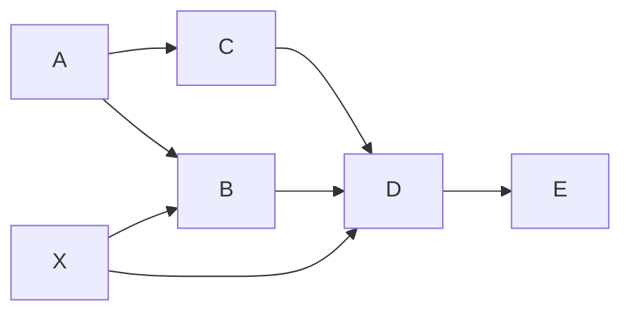

# AGENTS.md — <spec 名>（使用规则）

> **适用范围**：本项目启用「<spec 名>」spec 时，agent 承担任务先读本文件判定
> 入口、走路径。项目级总纲见仓库根 `AGENTS.md`。
>
> **本包内运转**：机制通则（spec 包结构、manifest / module.json 字段表、
> 状态灯、空值惯例、锁文件与冷启动校验）见模板框架 `spec/AGENTS.md`（出厂
> 即带）；「怎么造 / 改 spec 和模块」是构建规则，默认不读，需造 / 改时从
> 云端拉取 `build/`。

## 一、这个 spec 是什么

<一句话说明这套 spec 管什么场景，以及由哪些模块按依赖链编排，如：
「软件开发」场景的工作流，由 8 个模块按依赖链编排：vision → design → prd →
development → test → audit → release；adr 横切全局。>

## 二、依赖全景与入口

### 依赖全景（谁依赖谁）

箭头 =「上游 → 下游」（`A --> B` 表示 B 依赖 A）。上图展示三种常见形态：

- **并行**：B、C 都只依赖 A；
- **多依赖**：D 依赖 C、B、X 三个上游；
- **横切**：X 被 B、D 两个下游依赖。

例化时把 A / B / C / D / E / X 换成实际模块 id。

依赖是必要而非充分条件，依赖文件是必需的，但是不代表只需要。

### 入口（启用哪些模块）

按 <本 spec 自己的判定维度，如「是否动需求 / 动设计 / 要发布」> 判定入口
（入口可配置，改 `manifest.json` 的 entries）：

| 入口 | 判定 | 启用的模块 |
| ---- | ---- | ---- |
| <入口一> | <判定条件> | <模块集合> |
| <入口二> | <判定条件> | <模块集合> |

「启用的模块」是集合、不表顺序；执行顺序与依赖看上面的全景图。路径外的
模块不启用。入口判定拿不准时，先和用户对齐一句再动手。

## 三、控制权与检查点

工作流按控制权分两段，显式检查点只在**控制权交接**处设：

- **协作段**（<产出物与用户反复讨论协作的模块，如 vision / design / adr>）：
  每一步都过用户的手，天然处处是确认，不设显式检查点。
- **自主段**（<agent 全权连续执行的模块，如 development → test → audit>）：
  agent 全权连续执行，中间不打断（大问题例外，停下来回讨论）。

两个显式检查点：

1. **实施放行**（自主段入口）：需求 / 方案聊定、agent 转全权执行前，向用户
   确认「就这么干」，确认后才进入执行。
2. **收口放行**（release 前）：发布 / 推送是不可逆动作，动手前必须征得
   用户同意（红线兜底，此处显式重申）。
