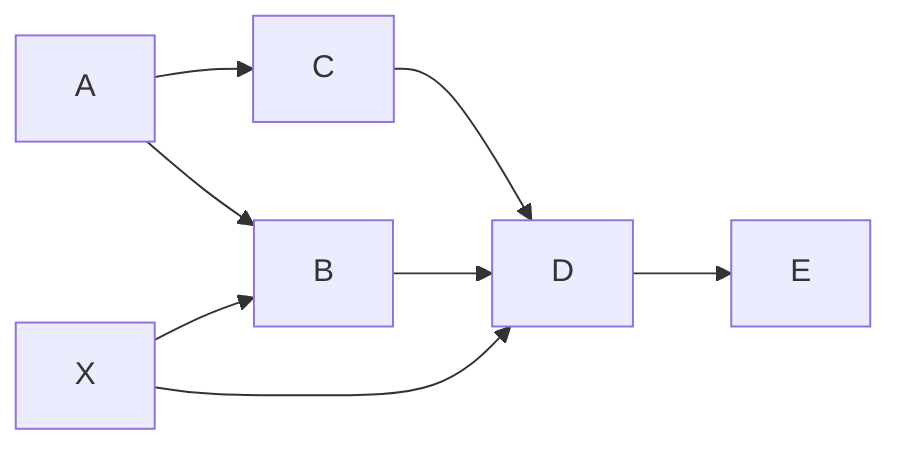

# <spec 名> — spec

> 管什么场景：<一句话说明这套 spec 管什么场景>。
>
> 版本 0.1.0（云端货架版本；拉进项目后自由改，本地以 git 为准）。
>
> 项目级总纲见仓库根 `AGENTS.md`；spec 机制通则（spec 是什么、怎么拉、
> 怎么读、状态灯约定）见模板框架 `spec/AGENTS.md`。

## 一、这套工作流

<场景一句话>，由 <N> 个阶段按依赖链编排：

<阶段 id（名）→ 阶段 id（名）→ …；<横切阶段> 横切全局。>

## 二、依赖全景 · 入口 · 检查点

### 全景（谁依赖谁）

箭头 =「上游 → 下游」（`A --> B` 表示 B 依赖 A）。上图展示三种常见形态：
并行（B、C 都只依赖 A）、多依赖（D 依赖 C、B、X）、横切（X 被 B、D 依赖）。
写实际 spec 时把 A / B / C / D / E / X 换成实际阶段 id。依赖是必要而非充分
条件：依赖的产出文件是必需的，但不代表只需要它。

### 入口（缩放旋钮：不同大小的任务走不同档）

按 <本 spec 自己的判定维度，如「是否动需求 / 动设计 / 要发布」> 判定入口：

| 入口 | 判定 | 启用的阶段 |
| --- | --- | --- |
| <入口一> | <判定条件> | <阶段集合> |
| <入口二> | <判定条件> | <阶段集合> |

「启用的阶段」是集合、不表顺序；执行顺序与依赖看上面的全景图。<横切阶段>
横切、不列入入口。路径外的阶段不启用。入口判定拿不准时，先和用户对齐一句
再动手。

### 控制权与检查点

工作流按控制权分两段，显式检查点只在**控制权交接**处设：

- **协作段**（<产出物与用户反复讨论协作的阶段，如 vision / design / adr>）：
  每一步都过用户的手，天然处处是确认，不设显式检查点。
- **自主段**（<agent 全权连续执行的阶段，如 development → test → audit>）：
  agent 全权连续执行，中间不打断（大问题例外，停下来回讨论）。

两个显式检查点：

1. **实施放行**（自主段入口）：需求 / 方案聊定、agent 转全权执行前，向用户
   确认「就这么干」，确认后才进入执行。
2. **收口放行**（release 前）：发布 / 推送是不可逆动作，动手前必须征得用户
   同意（红线兜底，此处显式重申）。

## 三、各阶段

<!-- 每个阶段一个小节，统一三段式；按需增删。有产出骨架的阶段把模板放
     assets/、在「产出」行指向它；没有产出文档的阶段（如纯执行 / 审计）
     不写 assets 指针。删掉本注释。 -->

### <阶段 id> — <名>

- **产出**：`<落点路径>`（实例化参考 `assets/<template>.md`，若本阶段有产出
  骨架）。
- **运行过程**：① <第一步>；② <第二步>；③ <第三步>。
- **规范 / 边界**：<关键约束>。不管<不属于本阶段的事>。

### <横切阶段 id> — <名>（横切）

- **产出**：`<落点路径>`。
- **运行过程**：<…>
- **规范 / 边界**：<…>
