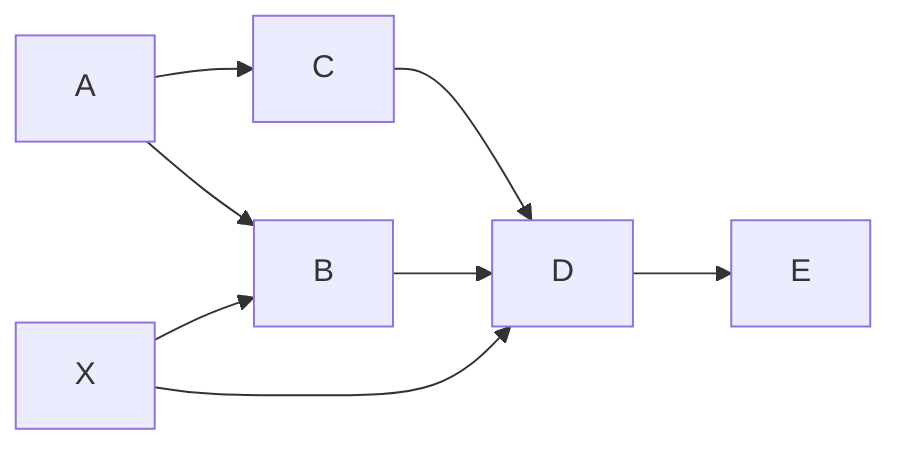

# AGENTS.md — <spec 名>（使用规则）

> **适用范围**：本项目启用「<spec 名>」spec 时，agent 承担任务先读本文件判定
> 入口、走路径。项目级总纲见仓库根 `AGENTS.md`。
>
> 本文件是**使用规则**（默认读）。「怎么造 / 改 spec 和模块」是构建规则，
> 默认不读，见 `spec/build/`。

## 一、这个 spec 是什么

<一句话说明这套 spec 管什么场景，以及由哪些模块按依赖链编排，如：
「软件开发」场景的工作流，由 8 个模块按依赖链编排：vision → design → prd →
development → test → audit → release；adr 横切全局。>

模块目录以 `@` 前缀标识（如 `@vision/`）；`@` 只是目录命名，模块 id 不含
`@`（`module.json` 的 `id` 是 `vision`）。

## 二、这个 spec 包里有什么

```
<spec id>/
  manifest.json      ← 组织清单（脚本读）：spec 身份 + 模块声明 + 入口
  AGENTS.md          ← 入口指引（本文件，默认读）
  CHANGELOG.md       ← 版本变更日志（跨版本迁移看它）
  lockfile.md        ← 锁文件规范：讲有哪些字段
  lockfile.json      ← 锁文件账本：空示例，初始化时 agent 照着填
  @<module-id>/      ← 模块目录，每个内含 MODULE.md / module.json / README.md / CHANGELOG.md / assets
```

### manifest.json 字段

| 字段 | 类型 | 语义 |
| --- | --- | --- |
| `id` | string | spec 唯一标识（连字符小写命名） |
| `name` | string | spec 名 |
| `version` | string | 版本（semver） |
| `description` | string | 一句话说明这套 spec 管什么场景 |
| `modules` | string[] | 模块声明：这个 spec 需要哪些模块 |
| `entries` | object[] | 入口列表（缩放旋钮） |
| `entries[].id` | string | 入口标识（连字符小写命名） |
| `entries[].name` | string | 入口名 |
| `entries[].modules` | string[] | 这个入口启用哪些模块（集合，不表顺序） |

## 三、依赖全景与入口

### 依赖全景（谁依赖谁）



箭头 =「上游 → 下游」（`A --> B` 表示 B 依赖 A）。上图展示三种常见形态：

- **并行**：B、C 都只依赖 A；
- **多依赖**：D 依赖 C、B、X 三个上游；
- **横切**：X 被 B、D 两个下游依赖。

例化时把 A / B / C / D / E / X 换成实际模块 id。

依赖是必要而非充分条件，依赖文件是必需的，但是不代表只需要。

### 入口（启用哪些模块）

按 <本 spec 自己的判定维度，如「是否动需求 / 动设计 / 要发布」> 判定入口
（入口可配置，改 `manifest.json` 的 entries）：

| 入口 | 判定 | 启用的模块 |
| ---- | ---- | ---- |
| <入口一> | <判定条件> | <模块集合> |
| <入口二> | <判定条件> | <模块集合> |

「启用的模块」是集合、不表顺序；执行顺序与依赖看上面的全景图。路径外的
模块不启用。入口判定拿不准时，先和用户对齐一句再动手。

## 四、模块字段表（module.json 12 字段）

填模块的 `module.json` 时查这张表：

| 字段 | 类型 | 语义 | 缺失时按什么处理 |
| --- | --- | --- | --- |
| `id` | string | 唯一标识（连字符小写命名） | 必须填，缺失报错 |
| `name` | string | 模块名 | 必须填 |
| `version` | string | 版本（semver） | 必须填 |
| `description` | string | 一句话职责（看板 / 清单展示） | 必须填 |
| `input` | string[] | 输入来源（组装画依赖线 / 看板展示） | 视为 `[]` |
| `output` | string[] | 产出物（下游认领的契约） | 视为 `[]` |
| `depends_on` | string[] | 依赖的模块 id | 视为 `[]`（无依赖） |
| `workspace` | object | 键 = 产物名，值 = 落点路径 | 视为 `{}` |
| `enable.instantiate` | string[] | 启用时例化的文件路径 | 视为 `[]` |
| `disable.keep` | string[] | 停用时保留的文件路径 | 视为 `[]` |
| `private` | bool | `true` = 项目私有外挂模块 | 视为 `false` |
| `self_implemented` | bool | `true` = 占空自实现，项目自填 | 视为 `false` |

补充约定：

- **json 放脚本会读的**：字段供脚本解析（构建 / 例化脚本读 id / name /
  version / depends_on / workspace / instantiate / keep；清单脚本读
  description / input / output）。脚本不消费、纯给人 / agent 读的语义（适用
  与边界、依赖哪个产出、运行过程、产物内容），写进 `MODULE.md` 或
  `README.md`，不进 json。
- **依赖只记模块 id**：`depends_on` 只列「依赖哪些模块」；「依赖它的哪个
  产出」是语义，写在 `MODULE.md`。
- **来源标注归锁文件**：模块是「云端例化副本」还是「项目私有」，源头与
  版本不进 `module.json`，归 `lockfile.md`。

## 五、状态灯：写在文档头部

模块的产出文档若有生命周期状态（如 PRD 的草稿 → 开发中 → 定格），不在
`module.json` 里声明，而是**写在每个产出文档的头部**两行：

```
> 状态：草稿
> 换档：交付给下游 → 开发中；开发完成 → 定格
```

- 换档即改「状态」那一行，随文档修改一起落盘（历史交给 git）。
- 头部没有状态声明的文档 = 活文档，随时可改。
- 换档事件的达标线（什么算交付达标）由 spec 定义，不写在文档头部。

## 六、空值处理惯例

- **空但有语义 → 留空**（`[]` / `{}`）：如 `depends_on: []` 表示「无依赖」，
  是有效信息。
- **不适用 → 删字段，不写 `null`**：字段对本模块无意义时直接删，不占位。
- **适用但值暂缺 → 留 `null`** 显式标注（如版本约束未定时）。
