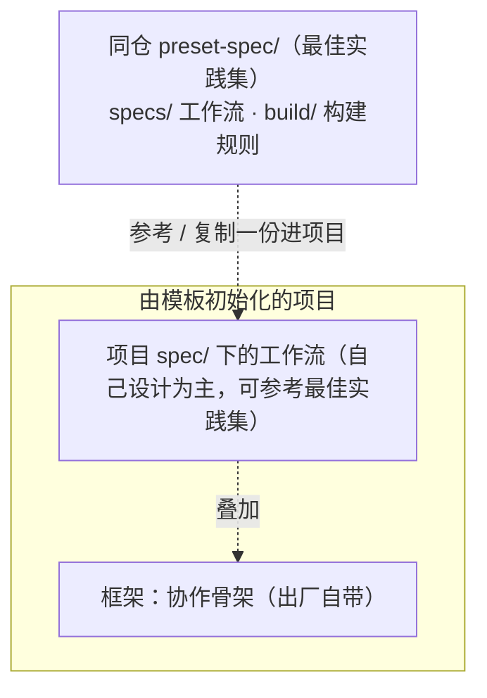

# preset-spec/ — spec 最佳实践集

本目录是 [project-spec 公开仓](https://github.com/The-Daybreaker/project-spec) 的最佳实践集部分，与 `init-project/`（[通用项目模板](../init-project/)）同仓存放。如果说模板提供的是**每个项目都一样的协作骨架**（任务板、AI 记忆、冷启动协议、行为规范），本目录提供的就是**可供参考的工作流最佳实践**：做软件有做软件的流程，开发 skill 有开发 skill 的流程，这些流程统称 spec，统一摆在这个「最佳实践集」里供浏览、参考。

## 为什么最佳实践集不随模板分发

框架和工作流的变化频率完全不同：协作骨架追求稳定、每个项目通用；工作流因项目类型而异、高频演进，而且拉进具体项目后几乎一定要按项目情况改。所以模板不预置任何工作流，初始化时 `init_project.py` 也不复制本目录；本目录**只是最佳实践集**——不做只读锁定、不做防漂移校验、不要求保持同步：**复制一份进项目就是你的，自由改**，本地演进交给 git 记录。

## spec 是什么

一个 spec = **一份 `spec.md` 主干 + 一个同级 `assets/`（产出文档骨架）**：

- **`spec.md`**：这套工作流的全部内容，一份文档读完就懂整套流程——使用场景、分哪几个阶段、阶段之间怎么衔接、设几档入口（流程调节）、哪里设检查点，以及每个阶段的产出落点、运行过程与规范边界。
- **`assets/`**：各阶段产出文档的参考骨架（如愿景、方案、PRD、测试用例、决策记录的模板），`spec.md` 按需指向它们。

举个具体例子。最佳实践集里的 `software-dev`（软件开发）spec 把工作切成 8 个阶段：`vision（愿景与排期）→ design（方案）/ prd（当期需求）→ development（开发）→ test（测试）→ audit（审计）→ release（收口）`，其中 `adr（决策记录）` 横切全局；这条链是推荐推进顺序、并不强制，可按实际情况调整。同时设了三档入口——改个错别字只走 development，做个小功能走 prd + development + test，完整一期才走全流程。这就是「简单的事不走重流程，复杂的事不漏环节」。

`spec.md` 内部是固定结构：头部（使用场景 + 版本）→ §一 这套工作流（阶段链）→ §二 概览（全景 · 入口 · 检查点）→ §三 各阶段（每阶段写清产出落点 / 运行过程 / 规范边界，运行过程分步用有序列表）。这是「渐进式披露」：主文档保持精炼、用于导航，骨架作为附件到了对应阶段才读，不把所有东西塞进一个文件。

## 最佳实践集里有什么

| 路径 | 是什么 |
| --- | --- |
| `specs/` | spec 最佳实践：每个 spec 一个目录，内含 `spec.md` + `assets/` + `CHANGELOG.md` |
| `build/` | 构建规则：`build.md`（怎么写一份 spec.md）+ `spec-template/`（spec.md 骨架母版）；默认不读，只有造 / 改 spec 时才拉 |

**现有哪些 spec、各自适用于什么场景、什么版本，直接浏览 `specs/` 目录即可**——每份 `spec.md` 开头就自报场景与版本。本 README 不复制清单，免得两处记账、清单过时。

## 怎么消费本目录

日常干活不在本目录里进行，消费动作发生在**由 init-project 初始化的项目**中。模板出厂时，项目的 `spec/` 目录已自带机制说明书 `AGENTS.md`（讲 spec 是什么、怎么设计与获取、怎么读）。分两种场景：

### 1. 自己设计一份 spec（推荐）

每个项目的场景不同，**以自己设计为主、最佳实践作参考**。设计 spec 推荐按「还原场景 → 场景拆流程 → 流程抽象为 spec」的方法论推进：

1. **还原场景**：和用户一起把项目的典型工作场景讲清楚（谁、做什么、产出什么、有什么约束）；
2. **场景拆流程**：把场景拆成阶段链（推荐推进顺序 + 横切阶段），设几档入口（流程调节）；
3. **流程抽象为 spec**：按 `build/spec-template/` 母版写成 `spec.md`（头部 + §一 工作流 + §二 概览·入口·检查点 + §三 各阶段三段式），按需补 `assets/` 产出骨架。

设计时可以参考 `specs/` 里的现成最佳实践，但不要照搬——以自己项目的场景为准。

### 2. 参考或复制一份现成最佳实践

1. 浏览 `specs/` 选定一个 spec，读它 `spec.md` 开头确认场景合适；
2. 本仓就在手边时，直接从本目录复制；只有技能目录里的 `init-project/` 副本时，从公开仓下载 `preset-spec/` 需要的目录；
3. 把 `specs/<id>/` 里的 `spec.md` + `assets/` 复制进项目的 `spec/<id>/`（`CHANGELOG.md` 是最佳实践集的版本历史，可不带——项目本地以 git 为准）；
4. 之后这份 spec 归项目所有，按项目情况自由改。

要造 / 改 spec 的结构，把本目录的 `build/` 复制到项目的 `spec/build/`，按 `build.md` 的规则和 `spec-template/` 母版写。造好的内容可以回流本目录（向公开仓贡献），成为最佳实践集的新版本。

spec 机制的完整说明书随模板出厂、不在本目录（本目录只放 spec 内容本身）；在项目里读 `spec/AGENTS.md`。

## 版本约定

每个 spec 的版本写在它 `spec.md` 顶部，变更历史记在同目录 `CHANGELOG.md`，遵循语义化版本（SemVer）；`build/` 的版本写在 `build.md` 顶部。spec 拉进项目后归项目自由改，最佳实践集版本只标「最佳实践集里这是哪一版」，供日后对照升级。
