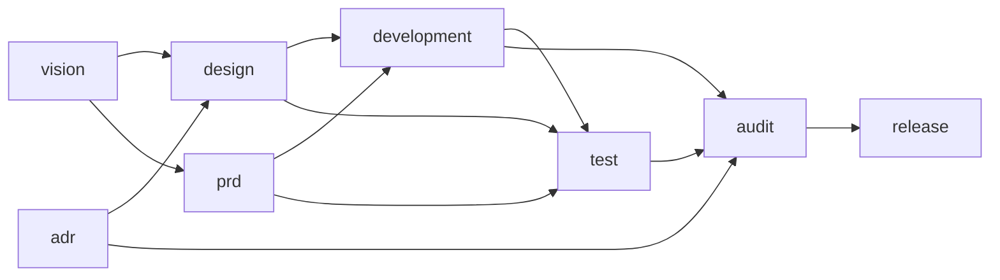

# 软件开发 — spec

> 使用场景：个人长期维护项目软件开发——从一个想法到一期发布的完整工作流。版本 0.1.0（最佳实践版本；参考使用，可自由修改，本地以 git 为准）。项目级总纲见仓库根 `AGENTS.md`；spec 机制通则（spec 是什么、怎么设计与获取、怎么读、状态标记约定）见模板框架 `spec/AGENTS.md`。

## 一、这套工作流

「软件开发」场景，由 8 个阶段编排，推荐推进顺序：

vision（愿景与排期）→ design（方案与设计）/ prd（当期需求）→ development（开发执行）→ test（测试与验收）→ audit（审计）→ release（收口）；adr（决策记录）横切全局。

## 二、概览

### 全景

箭头 =「上游 → 下游」（`vision --> design` 表示 design 在 vision 之后）。 prd 可以与 design 并行，adr 横切（design、audit 都会用到它）。箭头顺序是推荐的阶段顺序，并不强制，可以根据实际情况进行调整。

**回溯（改了上游往下查）**：改动某阶段的产出后，沿全景图箭头往下逐一核查所有下游阶段是否受影响、要不要跟着改（如改了 vision → 回看 design / prd → development → test → audit → release）；查多深以「下游是否用到被改的内容」为准，用到了就需要纳入任务进行核查和调整。

### 入口（流程调节：不同大小的任务走不同档）

按「是否动需求 / 是否动设计 / 是否要发布」三个维度判定入口：

| 入口 | 判定 | 启用的阶段 |
| --- | --- | --- |
| tweak 微调 | 不动需求、不动设计、不发布（错字 / 小 bug / 样式） | development |
| feature 小功能 | 动需求、不动架构、不发布（一个明确小功能） | prd + development + test |
| phase 一期 | 动排期、可能动设计、要发布（完整一期） | vision + design + prd + development + test + audit + release |

「启用的阶段」是集合、不表顺序；执行顺序参考上面的全景图。adr 横切、不列入入口。路径外的阶段不启用。入口判定拿不准时，先和用户对齐再动手。

### 控制权与检查点

工作流按控制权分两段，显式检查点只在**控制权交接**处设：

- **协作段**（vision / design / prd / adr）：产出物是和用户反复讨论协作出来的，每一步都过用户的手，天然处处有确认，不设显式检查点。
- **自主段**（development → test → audit）：agent 全权连续执行，中间不打断（大问题例外，停下来回去讨论，判断标准见 development 阶段）。

两个显式检查点：

1. **实施放行**（自主段入口）：需求 / 方案聊定、agent 转全权执行前，向用户确认「就这么干」，确认后才进入 development。
2. **收口放行**（release 前）：发布 / 推送是不可逆动作，动手前必须征得用户同意（作为红线在此显式重申）。

## 三、各阶段

### vision — 愿景与排期

- **产出**：`context/vision.md`（实例化参考 `assets/vision-template.md`，仅参考格式，内容由项目自行实现）。
- **运行过程**：
  1. 接收想法——用户丢来一个想法（可能一句、可能模糊），先复述确认理解，不急着落盘；
  2. 引导澄清——用开放、发散问题引导用户发现并澄清真正的需求（给谁用、解决什么、为什么现在做、做到什么程度算好），没说清的显式标「未定」，不替用户脑补；
  3. 调研——就需求查市场现成做法，调研结果形成一份临时文档给用户过目，认可后归档 `archive/research/`，结论吸收进正文；
  4. 落盘——聊定后更新 `context/vision.md`，只留需求现状、不留历史，及时写不攒批；
  5. 进入未排期池——新想法未排期前一律先进「未排期池」，排期时由用户从池里挑；
  6. 近三期排期表滚动更新。
- **规范 / 边界**：只记方向、不写死方案；未定的事显式标「未定」；内容不自动成为排期需求（进入排期须走流程并经用户确认）。不涉及方案、技术选型。

### design — 方案与设计

- **产出**：`context/design/`——`design.md`（方案主体）+ 按需图纸（实例化参考 `assets/design-template.md`）。
- **运行过程**：
  1. 写方案——读需求和已有决策，和用户讨论，把这一期的选路决策组织成一份整体方案写进 `design.md`（系统简单到脑子装得下就不写方案）；
  2. 画图——方案里复杂的地方按需画图细化，常用五种（架构图 / 接口契约 / 数据模型 / 关键流程走查 / 交互原型），不限于此、需要什么画什么，画完及时向用户展示与讲解；
  3. 活文档——开发中发现方案或图纸不对，直接改（历史交给 git）。
- **规范 / 边界**：方案是整体、决策是散点（`design.md` 把决策组织成整体方案）；文件类型优先选用户可直接打开查看的（html / markdown / jpg 等），需中间格式（svg / canvas 等）时原始中间格式文件也保留；图纸按需取用、不预先生成用不到的图。不涉及需求。

### prd — 当期需求

- **产出**：`context/prd/`——每期一份 `PRD-NNNN.md`，编号递增（实例化参考 `assets/prd-template.md`）。
- **运行过程**：
  1. 本期需求确认——和用户讨论确认需求排期，如项目有排期表可从中取这一期要做的内容，先对齐「这一期做什么」；
  2. 澄清细化——用开放问题聊深聊透（每条需求给谁用、解决什么、做到什么程度算好），没说清的显式标「未定」；
  3. 调研——就需求查市场 / 技术现成做法，调研结果形成临时文档给用户过目，认可后归档 `archive/research/`，结论吸收进正文；
  4. 落盘——聊定一条就覆盖更新当期 PRD 一次（历史交给 git）；
  5. 更新状态——交付达标时 PRD 头部状态从「草稿」改「开发中」，开发完成时改「定稿」；
  6. 交付定稿——这期交付后 PRD 定稿，新需求新开一份。
- **规范 / 边界**：PRD 是当期开发过程中的活文档，开发中随时改、交付即定稿；未定的事显式标「未定」；内容不自动成为当期需求（即使有排期表可取，也须经对话聊定）。不涉及长期方向、怎么实现。

### adr — 决策记录（横切）

- **产出**：`context/adr/`——`decisions.md`（当前仍有效的决策，实例化参考 `assets/decisions-template.md`）+ `history.md`（被取代的决策，默认不读）。
- **运行过程**：
  1. 决策及时记录——在对话中确定一个重要决策后，马上写进 `decisions.md` 顶部；
  2. 过程归讨论记录——选路的对比过程（比了哪些路、当时怎么想）写进 `archive/discussion/`，不写进 `decisions.md`；
  3. 取代——每次写入时回读全文，发现决策重复或被推翻时，从 `decisions.md` 整段移出、记入 `history.md` 顶部，加一行「何时被何取代」，旧文不涂改。
- **规范 / 边界**：`decisions.md` 只放当前仍有效的决策，新决策写在最上面；被推翻的决策不删、写入 `history.md`（默认不读，追溯时才翻）。不涉及需求、方案整体组织。

### development — 开发执行

- **产出**：`workspace/src/`（代码 / 产物，按任务逐步产出，无模板可实例化）
  + `process/goal.md`（本期目标）。
- **运行过程**：
  1. 定目标——读相关文档，和用户讨论定出这一期开发的目标，写进 `process/goal.md`；
  2. 拆任务——把目标拆成任务，记到 `process/task.md`；
  3. 开发——得到用户确认后根据目标 + task.md 全权执行，当期任务一次性做完，过程中及时做单元测试等自测；
  4. 反馈——小问题记下继续、做完统一反馈，大问题（耦合高 / 影响广 / 根基有问题）停下来回去讨论；
  5. 及时更新 task 状态，任务完成后告知用户完成了哪些、有哪些需 review，需要留验收凭据时在 `process/` 根写 `review-<简介>.md`（临时件）；用户确认通过后 agent 及时删除该 review 件（历史交给 git）、goal.md 归档 `archive/goal/`。
- **规范 / 边界**：小问题随做随记（记在任务板），做完统一记 review 并反馈；大问题判断标准——耦合高、影响面广、根基有问题，停下来回去讨论；git 提交信息遵循 Conventional Commits（feat / fix / docs 等）。不涉及审查、发布。

### test — 测试与验收

- **产出**：`context/test/`——每期一份 `TEST-NNNN.md`（测试用例 + 测试结果，实例化参考 `assets/test-template.md`）。
- **运行过程**：
  1. 整理用例——开发完，根据验收标准 + 开发产物整理这一期的测试用例；
  2. 按用例测试——按测试用例跑，记录结果（过 / 不过 / 用户验证）；
  3. 用户验证——agent 无法自测的部分交给用户，实际体验一遍算真做完；
  4. 归档——这期测完，测试文档原地归档、默认不删除，下一期新开一份。
- **规范 / 边界**：小需求小修复免全套；用例从需求的验收标准来、不凭空造。不涉及审查、发布。

### audit — 审计

- **产出**：审计报告（作为 review 临时件走验收，落 `process/` 根 `review-<简介>.md`）；验收通过后删除（历史交给 git）。
- **运行过程**：
  1. 自审——先查一遍密钥是否外泄、有没有做需求外的东西、文档和代码是否对应；
  2. 独立审查——换一个不带开发记忆的独立 agent 再次进行对抗式审查；
  3. 输出报告——写审计报告、附审计结论，放行或打回，隐患列清单、修复后再查。
- **规范 / 边界**：查工程卫生、不查产品行为（产品行为归功能验证）；对抗性——假设有问题、主动找证据推翻「做完了」的宣称；根据项目特点审计（如 coding 开发重点审代码）。不涉及发布。

### release — 收口

> 本阶段为占位自实现：最佳实践集只给骨架，收口做法由项目自行填充。

- **产出**：交付物落 `workspace/dist/`；变更日志写 `workspace/CHANGELOG.md` （给用户的版本日志，随发布）。
- **运行过程**：
  1. 写 CHANGELOG——把这期做了什么写进 `workspace/CHANGELOG.md`；
  2. 确认收口方式——私有项目本地打 tag、本地安装即发布，公开项目上传 GitHub；
  3. 不可逆动作动手前，把方案明说、征得用户同意。
- **规范 / 边界**：收口是项目自定义的，模板只留位置、具体怎么做每个项目自己定；发布 / 推送是不可逆动作，动手前必须征得同意。不涉及开发、测试、审查，也不涉及不更新用户版本号的小修改。
