# FLOW — 项目运转流程与状态机总图

> 模块：混合（【通用】= 阶段体系/动作状态机可随模板升级；【项目专用】= 本项目实例）。
> 用途：穷举项目运转的**每种动作的链路**与**每个动作的状态机**；「每个阶段单独运行时的
> 流程（含阶段外行为）」的单一真相，配 `private/dev/PHASES.md`（阶段模块权威定义）使用。

## 0. 双维度模型

- **主流程维度**：P1-P5 五阶段**串行**，一次只专注一个，严禁跨阶段；
- **贯穿维度**：文档维护/STATUS 落盘/git 提交/经验沉淀/审计/删除归档等**不占阶段**，
  任何阶段内都可触发，每次走各自状态机并落盘。
- 阶段切换：🔵 决策型（P1/P2）→ 展示阶段卡 + **用户确认**后放行；🟢 执行型（P3/P4）→
  展示阶段卡，无反对即继续；P5 发布动作**另行确认**（红线 2）。

## 1. 主流程总图

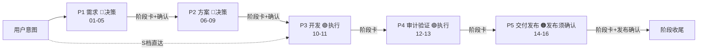

## 2. 每阶段子流程（阶段内子阶段 + 阶段外行为挂载点）

> 每个子阶段：干活 → 产物 → 质量校验 → 落盘 STATUS → 展示阶段卡 → git 提交。
> 🔵 决策型子阶段等用户点头；🟢 执行型子阶段展示后无反对即继续。

### P1 需求（01-05，决策型）

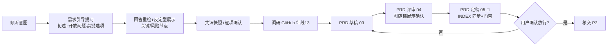

### P2 方案（06-09，决策型）

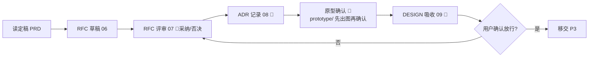

### P3 开发（10-11，执行型）

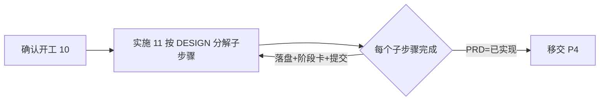

### P4 审计与验证（12-13，执行型）

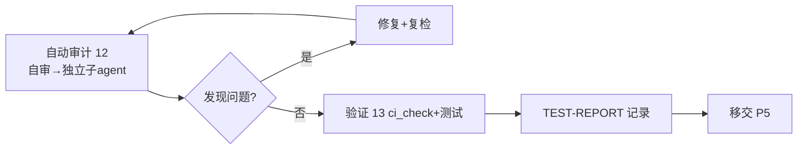

### P5 交付发布（14-16）

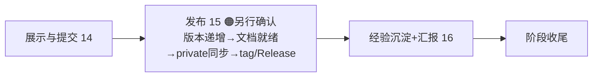

## 3. 动作状态机（穷举动作链路）

### 3.1 需求引导（P1 内嵌）

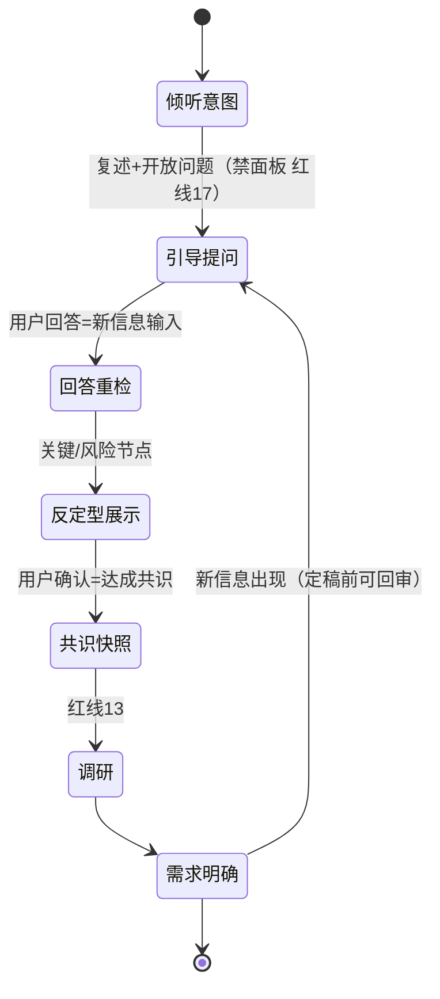

### 3.2 发版

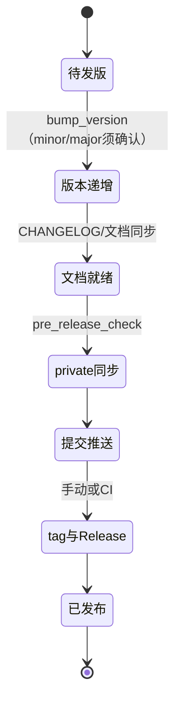

### 3.3 同步模板（仅模板母项目；本项目升级见 `docs/UPGRADE.md`）

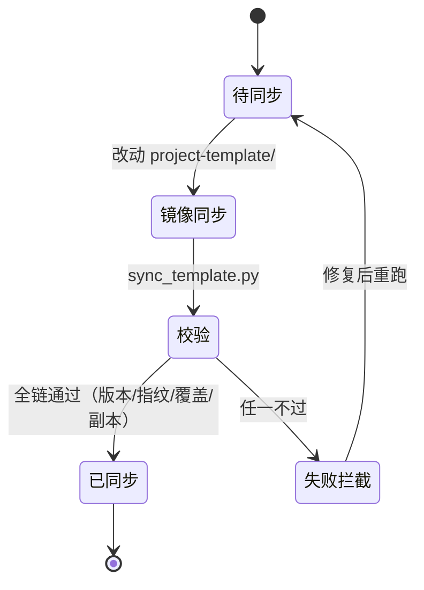

### 3.4 文档更新（贯穿，红线 12）

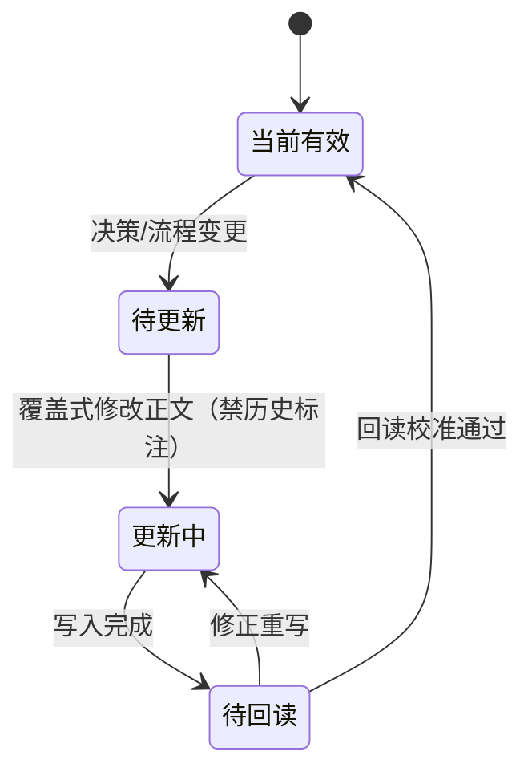

### 3.5 STATUS 快照更新（贯穿）

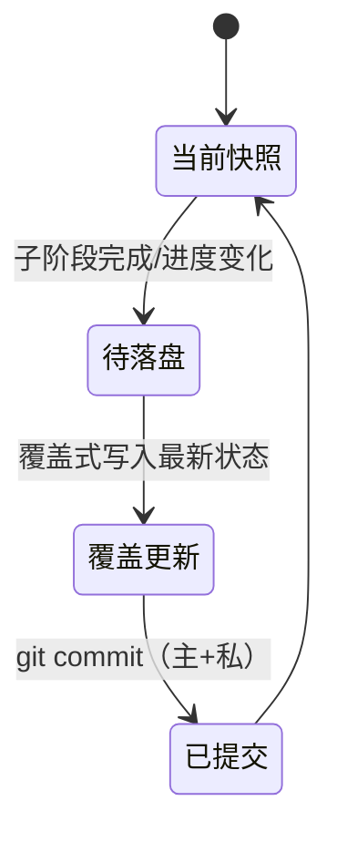

### 3.6 审计（P4，红线 3）

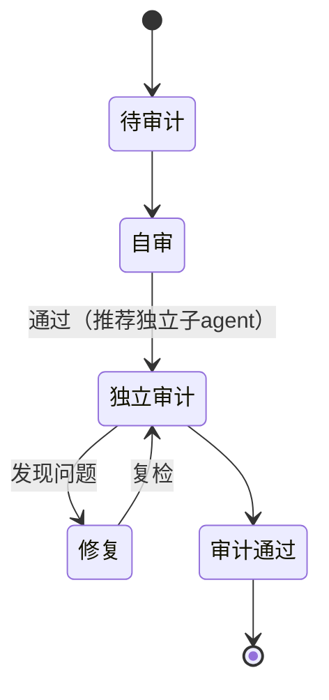

### 3.7 经验沉淀（贯穿，红线 9）

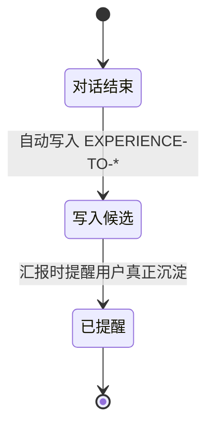

### 3.8 删除/归档（贯穿，红线 4）

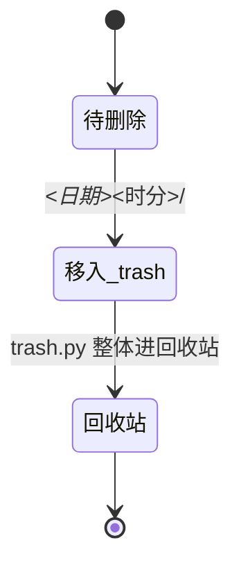

## 4. 动作 → 归属映射（谁在哪个阶段跑）

| 动作 | 主流程归属 | 贯穿可用 | 状态机 |
|---|---|---|---|
| 需求引导/调研/PRD | P1 | — | 3.1 / 登记册 |
| RFC/ADR/原型/DESIGN | P2 | — | 登记册 |
| 实施 | P3 | — | 3.4 |
| 审计/验证 | P4 | — | 3.6 |
| 展示/发布/沉淀 | P5 | — | 3.2 / 3.7 |
| 文档更新 | 任意阶段 | ✓ | 3.4 |
| STATUS 落盘+提交 | 任意阶段 | ✓ | 3.5 |
| 删除归档 | 任意阶段 | ✓ | 3.8 |
