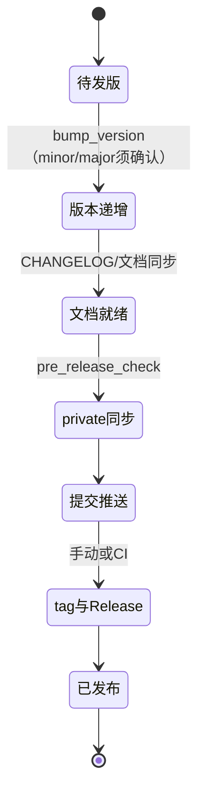

# AGENTS.md — {{PROJECT_NAME}} 开发指引（私有）

> 模块：混合（【通用】= 工作流/发布/红线/清单；【项目专用】= 状态/环境/决策/记录）。
> 本文件位于 `private/` 内，由 **private 子 git** 管理，仅本机/本工作区的开发 agent
> 读取，**不进 GitHub**。承载项目开发与维护的完整规范、文件分类归属、本机环境与
> 用户决策，是**唯一常青开发记忆**（任何新对话从零接手本项目都先读本文件）。
> 与根 `AGENTS.md`（公开版）冲突时，本文件中的开发/机器/个人专属细节以本文件为准。
> **阶段体系权威定义见 `dev/PHASES.md`（I/O/产物/生命周期/16节点映射/切换规则/需求引导/
> 文档映射/流程图与状态机）；当前进度见 `dev/STATUS.md` 快照。**
> **新对话/上下文压缩后必须先重读本文件、根 `AGENTS.md`、`dev/STATUS.md` 与
> DESIGN/CHANGELOG/TEST-REPORT 后再继续（红线 16）。**

## 【项目专用】项目状态与版本

- **当前版本**：{{VERSION}}（`dev/CHANGELOG.md` 有完整历史）。
- **模板版本**：根 `version.json` 的 `template_version`（初始化/升级时的通用项目
  模板版本；升级见根 `AGENTS.md`「模板升级」与 `../docs/UPGRADE.md`）。
- **版本规则**：版本号**从 `0.0.1.patch0` 开始**，格式 `X.Y.Z.patchN`（第 4 段为
  字面 `patch` + 数字，从 0 开始）；补丁/小修复默认只升第 4 段（`patchN+1`）、
  普通功能升级升第 3 段并将第 4 段归零、大功能升级升第 2 段并将后两段归零；
  **前两位（major/minor）增加必须向用户确认**；破坏性变更必须用户确认并升主版本、
  说明迁移方案。
- **发布策略**：{{AUTO_RELEASE}}

## 【通用】仓库布局与文件分类归属（三区，开发强制要求）

<!-- REF:three-zones -->
三区：A 公开（主仓库）/ B 私有（`private/`，子 git，禁远端）/ C 不管理（.gitignore 忽略）；新增文件先判区再落盘，密钥绝不入库。全表与判定规则见根 `AGENTS.md`「仓库布局」节。
<!-- /REF -->

## 【通用】开发工作流（阶段体系；强制，每次需求都走完）

<!-- REF:phases -->
5 大阶段串行（需求→方案→开发→审计验证→交付发布）：决策型须用户确认、执行型展示即走、发布另行确认、严禁跨阶段、档位定裁剪；16 节点表、I/O、生命周期、流程图见 `dev/PHASES.md`。
<!-- /REF -->

<!-- REF:req-guide -->
**P1 需求引导（强制）**：先复述意图、提问澄清真实需求；未澄清前禁止抛方案选项。完整方法论（重检行/共识卡/硬触发）见 `dev/PHASES.md` §6。
<!-- /REF -->

- **档位判定**（与用户确认需求时同步判定）：**S**（小需求/修复/文档改动）P1 简化
  直达 P3；**M**（新功能/模块/引入新库）P1 全走（PRD 必需、RFC 可选、ADR 架构级
  必走）；**L**（新项目/架构级/技术栈选型）P1+P2 全走。详见 `dev/PHASES.md` §7。

**开发前要点（P1/P2 内，M/L 必走）**：
- **调研（红线 14）**：立项类话题先调研现成参考，「先调研再立项」；正式调研落
  `dev/research/RESEARCH-XXXX.md`；
- **PRD**：草稿 → 评审（图随稿展示确认）→ 用户确认定稿（门禁：字段齐全，含
  「所属版本」「关联路线图条目」）→ 同步 INDEX + ROADMAP 需求地图；
- **RFC**（M 复杂 / L 必走）：候选对比 → 用户拍板 → 同步 INDEX；
- **ADR**（架构级）：用户确认后新建（只增不改）→ 同步 INDEX + 本文件记
  D-xxx 一行摘要 + `详见 ADR-XXXX`；
- **原型**：涉及界面/交互先出图再确认（`dev/prototype/`，一文件一原型）；
- **DESIGN 吸收**：定稿方案覆盖式写入 `dev/DESIGN.md`（正文=当前状态，顶部链接
  RFC/ADR）。

**P3-P5 要点**：
- **复述确认（进入 P3 前）**：复述需求并列出方案要点；**未获确认不实施**；
- **实施（P3）**：按 DESIGN 修改，同步受影响文档（红线 13）；PRD 范围完成后
  状态=已实现 + 填实现版本 + 更新 INDEX；
- **审计验证（P4）**：自审 → 独立审计（只看 diff + 清单）→ 修复全部发现；
  `scripts/ci_check.py` + 测试记录 `dev/TEST-REPORT.md`；**未通过不发布**；
- **展示/提交/发布（P5）**：展示成果 → 提交 private 子 git → 主仓库提交推送 →
  按「发布流程」执行；
- **经验沉淀**：对话结束写入 `dev/EXPERIENCE-TO-TEMPLATE.md` 与
  `dev/EXPERIENCE-TO-KB.md`；架构变化/发布后提醒用户真正沉淀；
- **汇报（P5）**：汇总改动、版本、测试、Release 链接与回退方式，附「完成检查清单」。

### 流程提示（每次对话强制）

<!-- REF:stage-card -->
每次实质回复/落盘/恢复/收尾展示**合并紧凑阶段卡**（阶段线+合规两行，全中文名称）；以 `dev/STATUS.md`「📇 阶段卡」为单一真相；决策型推进前附 **📌 共识卡**（红线 18）。格式见 `dev/PHASES.md` §5。
<!-- /REF -->

- **每次阶段/子阶段完成**：落盘 `dev/STATUS.md` → 展示阶段卡 → git 提交
  （主仓库 + private 子 git，提交信息带阶段标识，如 `feat(P3.2): 实施子阶段 - 描述`）。
- **生命周期合规清单**：阶段卡含合规两行（✓ 已完成 / ⏳ 待完成，七项：文档同步 /
  状态落盘 / 阶段提交 / 质量校验 / 阶段确认 / 红线遵循 / 经验沉淀），让用户验证
  「任务完成 + 生命周期走完 + 按规范」。
- **缩写附中文翻译（强制）**（如 PRD=产品需求文档，见下表）；阶段卡内直接使用
  中文名称。

### 缩写对照（流程/文档展示用，强制附中文）

| 缩写 | 中文 |
|---|---|
| PRD | 产品需求文档 |
| RFC | 技术方案文档 |
| ADR | 架构决策记录 |
| RESEARCH | 调研记录 |
| DESIGN | 设计文档 |
| STATUS | 状态快照（原 WORKLOG 工作进度日志） |
| CHANGELOG | 变更日志 |
| TEST-REPORT | 测试报告 |
| CI / CD | 持续集成 / 持续交付 |

### 文档更新流程（贯穿全程，与阶段体系并行）

<!-- REF:doc-governance -->
文档就绪=「改动完成即文档就绪」（红线 13）：每子阶段完成同步受影响文档与登记册索引；发布前 `pre_release_check.py` + `check_dev_docs.py` 校验；正文=当前状态（历史文档区例外）。规则见下文「文档治理」节。
<!-- /REF -->

## 【通用】发布流程（每次发布时执行，md 驱动、agent 执行）

<!-- FACT:release-flow -->

- **动机**：发布动作不可逆且对外可见；按固定顺序执行、先同步私有子仓库再进
  主仓库，保证「发出的版本 = 验证过的状态」，私有内容绝不外发。

1. **版本递增**：默认只升补丁段（第 4 段）；运行 `scripts/bump_version.py
   --part patchn|patch|minor|major`（默认 `patchn`；按 `scripts/version-sync.json`
   同步 `version.json` 与 `package.json` / `Cargo.toml` / `pyproject.toml` 等），
   随后 agent 手工更新 `dev/CHANGELOG.md` 顶部条目（脚本只校验同步目标、不写
   CHANGELOG，防止覆盖人工编辑的发布说明）。
2. **检查受影响文档**（改动完成即文档就绪）：CHANGELOG / DESIGN / TEST-REPORT /
   STATUS / README / 根 AGENTS.md / 本文件 / 用户可见文档。
3. **提交 private 子 git（发布前必做）**：检查 `git -C private status --short`；
   有变更先 `git -C private add -A -- .` 并提交（`docs: private v<version> - 描述`），
   确认 `git -C private status --short` 干净后再进入主仓库发布。
4. **主仓库提交推送**：`git add -A -- .` + commit（普通提交
   `feat:/fix:/docs:/chore:/refactor: - 描述`；**发布提交**带版本号
   `feat: v<version> - 描述`）+ `git push`（origin、分支见「本机环境」）。
5. **打标签与 Release**：`git tag v<version>` + `git push origin v<version>`；
   创建 GitHub Release（`gh release create v<version> --title "v<version>"
   --notes "<变更摘要>" --attach <发布产物>`；gh 未认证时请用户 `gh auth login`，
  或网页手动上传）。推送 main 后 CI 也会自动完成第 5 步（仅当当前 version 尚无
   tag 时，不会二次递增版本；手动/自动二选一，见根 `AGENTS.md`「版本管理」）。
6. **分发/安装/部署**：按项目实际执行（安装包、zip、文档站点等）；**构建/打包产物
   统一输出到 `dist/`**（C 区生成物，不进 git，`.gitignore` 已忽略；`release.yml`
   自动 attach `dist/**`，产物在别处时同步调整 workflow）；**分发/打包前自测**：
   产物可运行、关键文件齐全、无密钥/配置/素材等运行时数据混入、**不含 `private/`
   内容（红线 19：禁打包）**。
7. **汇报**：附「完成检查清单」。

**发版状态机**：

> `scripts/pre_release_check.py` 可一键完成发布前检查（private 子 git 同步、
> 版本一致性、泄漏扫描、ci_check 实现检查、文档一致性）。
<!-- /FACT -->

## 【通用】项目归档/退役（停止主动开发时）

<!-- REF:archiving -->
用户明确发起，agent 不主动归档；流程 = 确认范围 → 最终发布 → README 归档标记 → 产物入 `archive/` → 经验沉淀 → 收尾干净；归档后只读。完整流程见根 `AGENTS.md`「项目归档/退役」节。
<!-- /REF -->

## 【通用】完成检查清单（每次交付附在最终回复中）

<!-- FACT:completion-checklist -->

- **动机**：交付质量靠逐项核对，不靠印象；清单让「完成」可以被用户逐条验证，
  也防止生命周期动作漏项。
- 与阶段契约对应：各阶段必做项见 `dev/PHASES.md` §8，交付时对照契约核验。

- [ ] 需求已复述并获用户确认
- [ ] 需求冲突检测已执行并出示报告（新需求对照定案清单/红线/架构决策）
- [ ] 被裁剪的阶段节点均有裁剪声明（为何可跳+用什么替代）并获用户确认
- [ ] **阶段卡已展示**且与 `dev/STATUS.md`「📇 阶段卡」一致（每次实质回复/
      阶段落盘/收尾），含生命周期合规清单
- [ ] 涉及 PRD/RFC/ADR/RESEARCH 的任务：文档状态与索引已同步（编号连续、INDEX
      与正文一致）；状态变更符合权限（定稿/采纳/废弃经用户确认，已实现由 agent
      实施完成后更新）
- [ ] 涉及界面/架构/流程的改动已用图（页面原型/架构图/流程图）向用户展示并获
      确认（开发工作流「可视化确认」；未涉及可勾选 N/A 注明）
- [ ] 图/原型文件已按约定落库（`dev/prd|rfc|adr/` 同目录或 `dev/prototype/`，
      Mermaid/SVG 单文件）
- [ ] `scripts/check_dev_docs.py` 通过（如涉及开发前文档；发布前必跑）
- [ ] 受影响文档已同步更新（CHANGELOG / DESIGN / TEST-REPORT / STATUS / README /
      根 AGENTS.md / 本文件 / 用户可见文档）
- [ ] **阶段落盘已完成**（每个阶段/子阶段后 STATUS 与受影响文档已更新，红线 15；
      阶段卡硬事实与实际一致）
- [ ] **阶段提交已完成**（每阶段/子阶段完成即 git 提交，主仓库 + private 子 git，
      提交信息带阶段标识，D14）
- [ ] 自动审计已完成（自审 + 独立 agent 审计），发现已修复
- [ ] 检查命令与测试通过，TEST-REPORT 已记录
- [ ] **本轮候选经验已完整写入 EXPERIENCE-TO-TEMPLATE / EXPERIENCE-TO-KB（如有）**
- [ ] private 子 git 已提交且 `git -C private status --short` 干净
- [ ] 版本号一致（version.json / CHANGELOG 顶部 / 各版本文件）且递增规则正确
- [ ] 已提交并推送（提交信息符合格式：普通提交不带版本号，发布提交带 vX.Y.Z.patchN）
- [ ] 已创建 GitHub Release（tag vX.Y.Z.patchN + 发布产物）
- [ ] 分发/安装/部署完成
- [ ] **已提醒用户沉淀经验**（架构变化/更新发布后：知识库沉淀 + 可复用经验
      集成进项目模板）
- [ ] **本轮 `_trash/` 临时删除文件夹已整体移入回收站（如有删除）**
- [ ] 立项类话题（思路/需求/架构/功能/产品）已做 GitHub 调研并提醒用户
      「先调研再立项」（根 AGENTS.md 红线 14；如适用）
- [ ] 已向用户展示成果、Release 链接与回退方式
<!-- /FACT -->

## 【通用】模板升级（详见 `../docs/UPGRADE.md`）

- 模板发布新版本时：读模板仓库 `CHANGELOG.md` → 比对根 `version.json` 的
  `template_version` → **只应用【通用】模块变更**（【项目专用】绝不覆盖）→
  回读校验 → 更新 `template_version` → 记录 CHANGELOG/STATUS。

## 【通用】文档职责划分

<!-- REF:doc-duty -->
每份文档唯一职责：ROADMAP 长期入口 / 本文件开发入口 / PHASES 阶段权威 / STATUS 状态快照 / 四登记册 / DESIGN / CHANGELOG / TEST-REPORT / 经验文档；职责表见 `docs/DOCS.md`「文档地图」。
<!-- /REF -->

## 【通用】文档治理（正文即当前状态）

<!-- FACT:doc-governance -->

- **动机**：文档与实现漂移会误导接手者，过时文档比没有文档更危险；正文只写
  当前状态、历史交给 git，文档才可信，也避免「留痕」造成多处重复。

0. **历史文档区例外**：`dev/prd/`、`dev/rfc/`、`dev/adr/`、`dev/research/` 是
   唯一允许正文留史的位置（PRD/RFC 定稿后冻结、ADR 只增不改、RESEARCH 发现记录
   只追加），按各自 `INDEX.md` 状态机维护；其余文档一律遵守第 1-5 条。
1. **正文 = 当前有效状态**：决策被修改时直接覆盖原文，不保留旧决策段落，禁止写
   「⚠️ 已取代 by …」这类历史标注。
2. **禁止 AI 追加历史**：AI 改决策时，不得自动在正文里追加大段历史决策说明。
3. **追溯用一行记录**：确需留痕时，只在 `dev/CHANGELOG.md` 记一行摘要
   （如 `vX.Y.Z.patchN：决策 A → B`），由用户决定是否记录，不进决策正文。
4. **废案/临时内容**：按用户意愿直接删除，不强制留痕；删除走
`_trash/<agent产品名>_<日期>_<时分>/`（如 `codex_2026-08-25_2330`）→
`scripts/trash.py` → 回收站，保证可恢复即可。
5. **可恢复性由删除机制保证**，不由「正文留废案」保证。

（细则见 `../docs/DOCS.md`「文档治理」。）
<!-- /FACT -->

## 【项目专用】本机环境

（按实际填写：工作区路径、工具链路径与版本、网络/镜像、沙箱限制、已知坑。
示例见知识库/文档协作项目（如适用）的做法——机器专属信息只写在这里，不写进公开文档。）

- 工作区：<填写>
- 工具链：<填写>
- 已知坑：<填写>

## 【项目专用】安装目标 / 部署目标

（按实际填写：各 agent 平台的 skill 目录、发布仓库、部署位置等。）

## 【项目专用】用户确认的设计决策（仅记录于本文件，不写入公开文档）

记录格式（**可扩展**，按项目需要增删字段）：`决策 / 原因 / 影响 / 不要`，编号追加
（如 D-001、D-002…）；**被推翻时按「文档治理」约定处理**——覆盖原文 + 在
`dev/CHANGELOG.md` 记一行摘要，不在正文保留旧段落；架构级决策每行附
`详见 ADR-XXXX`（完整理由在 `dev/adr/`，单一真相，不重复维护）。

- D-001 <决策标题>（<日期>）：决策=<…>；原因=<…>；影响=<…>；不要=<…>

## 【项目专用】定案清单（不得自行修改，先询问用户）

（按项目填写：已定案的架构/机制/约定，agent 不得以「更优方案」为由自行改动；
改动必须先询问用户。）

- <定案项 1>
- <定案项 2>

## 【项目专用】必须询问人类清单（停止并确认）

（按项目填写：出现以下情况 agent 必须停下询问用户，不得自行继续。）

- 不可逆删除（模型权重 / 批量素材 / 清空产出）
- 口令 / 密钥类操作
- 架构变更（触及上方定案清单）
- 外部交互异常（登录态失效 / 验证码 / 付费确认）
- 配置 / 推送远端
- （按项目补充）

## 【通用】删除纪律与数据安全

<!-- REF:redlines -->
删除先移 `_trash/<agent产品名>_<日期>_<时分>/`，任务结束 `python scripts/trash.py` 整体进回收站；永久删除须用户确认；不代为 `git init` 用户其他仓库、不破坏未提交改动。完整规则见根 `AGENTS.md` 红线 5 / 9。
<!-- /REF -->

- **上下文压缩/新对话后必须重读根 `AGENTS.md`、本文件、`dev/STATUS.md` 与相关文档
  再继续（红线 16）。**
- 变更分级、回读校验等通用红线见根 `AGENTS.md` 与 `../docs/audit-checklist.md`。
