# PHASES — 阶段模块权威定义

> 模块：混合（【通用】= 阶段体系/生命周期/切换规则，可随模板升级；【项目专用】= 本
> 项目实例化后的实际阶段记录与产物路径）。
> 用途：**阶段体系的单一真相**——每个阶段的输入/任务/产物/完成标志/退出条件/生命周期
> （含阶段外行为挂载点）、16 节点映射、子阶段切换规则、需求引导方法论、阶段↔文档
> 映射；**流程图与动作状态机也在本文件**（§0 总图、§4 子流程与状态机）。
> 当前进度见 `dev/STATUS.md` 快照。

## 0. 双维度模型

- **主流程维度**：P1-P5 五阶段**串行**，一次只专注一个，**严禁跨阶段**；
- **贯穿维度**：文档维护/STATUS 落盘/git 提交/经验沉淀/审计/删除归档等**不占阶段**，
  任何阶段内都可触发，每次走各自状态机并落盘（状态机见 §4）。
- 阶段切换：🔵 决策型（P1/P2）→ 展示阶段卡 + **用户确认**后放行；🟢 执行型（P3/P4）
  → 展示阶段卡，无反对即继续；P5 发布动作**另行确认**（红线 3）。

**主流程总图**：

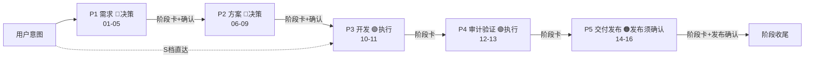

## 1. 阶段模块（16 节点映射）

<!-- FACT:phases -->

- **动机**：串行与产物化让每一步的「做没做完」可以被验证，严禁跨阶段防止
  拿上一步没确认的东西进下一步；决策型由人拍板、执行型展示即走，权责清晰。

| 模块 | 节点 | 类型 | 输入 | 明确产物 | 完成标志 | 退出条件 |
|---|---|---|---|---|---|---|
| P1 需求 | 01-05 | 🔵决策 | 用户意图 | PRD-XXXX 定稿 + RESEARCH | PRD 定稿 + INDEX 同步 | 阶段卡 + **用户确认** |
| P2 方案 | 06-09 | 🔵决策 | 定稿 PRD | RFC / ADR / 原型 / DESIGN | DESIGN 吸收 + 确认开工 | 阶段卡 + **用户确认** |
| P3 开发 | 10-11 | 🟢执行 | DESIGN + PRD | 实现代码 + 文档就绪 | PRD=已实现 | 展示阶段卡，无反对即继续 |
| P4 审计验证 | 12-13 | 🟢执行 | 实现产物 | 审计结论 + TEST-REPORT | 全部通过 | 展示阶段卡，无反对即继续 |
| P5 交付发布 | 14-16 | 🟠发布 | 验证产物 | commit/tag/Release/EXP | 发布 + 汇报附清单 | 展示阶段卡；发布另行确认 |

> 16 节点：A 开发前 01 需求提出 → 02 调研 → 03 PRD 草稿 → 04 PRD 评审 → 05 PRD 定稿 →
> 06 RFC 草稿 → 07 RFC 评审 → 08 ADR 记录 → 09 DESIGN 吸收；B 实施交付 10 确认开工 →
> 11 实施 → 12 自动审计 → 13 测试与验证（测试设计 → 自测执行 → 用户验收 → 结论入
> 测试报告）→ 14 展示与提交 → 15 发布 → 16 经验沉淀与汇报。
<!-- /FACT -->

## 2. 子阶段与确认规则（D10 力度 B）

每个模块内部按「有明确产物 + 完成标志的工作单元」拆子阶段；**每个子阶段完成时：
落盘 → 展示子阶段卡 → 停下**。停下后按类型处理：

| 类型 | 子阶段示例 | 处理 |
|---|---|---|
| 🔵 决策型子阶段 | PRD 定稿 / RFC 采纳 / ADR 记录 / 原型确认 / DESIGN 确认 / 发布 | 等用户**点头**才进入下一子阶段 |
| 🟢 执行型子阶段 | 调研 / 实施 / 审计 / 测试设计 / 自测执行 / 用户验收 / 提交 / 沉淀 | 展示子阶段卡，**无反对即继续（展示完直接走）** |

展示层级：先大阶段（P1-P5）→ 再子阶段（模块内细化）；阶段卡同时显示「模块 · 子阶段」
两级位置。设计原则：**分阶段为了专注，分子阶段为了细化**。

## 3. 阶段 ↔ 文档映射（披露隔离，D11）

| 阶段 | 本阶段读写 | 只读（上游产物） | 默认不读 |
|---|---|---|---|
| P1 需求 | `dev/prd/`、`dev/research/` | `dev/ROADMAP.md`（只读长期入口） | 方案 / 实现 / 历史 |
| P2 方案 | `dev/rfc/`、`dev/adr/`、`dev/prototype/`、`dev/DESIGN.md` | 定稿 PRD | 调研过程 / 候选对比 / 历史 |
| P3 开发 | `src/` 实现 + 受影响文档 | DESIGN.md + PRD | 调研 / 候选方案 / 历史 |
| P4 审计验证 | `dev/TEST-REPORT.md`、审计结论 | 实现产物 + DESIGN | 中间过程 |
| P5 交付发布 | `dev/CHANGELOG.md`、发布产物、EXP 沉淀 | 验证产物 | 中间过程 |
| 贯穿 | `dev/STATUS.md`、`dev/EXPERIENCE-TO-*` | — | — |

**质量门禁（隔离的前提）**：每阶段完成标志 = 产物齐全 + 校验脚本通过（如
`scripts/check_dev_docs.py` 门禁）+ 用户确认（决策型）；产物不过关不允许进入下一
阶段——下游阶段只信上游产物，所以产物必须可信。

## 4. 每阶段生命周期（阶段内流程 + 阶段外行为挂载点）

```
进入（读：必读 AGENTS/STATUS + 本阶段文档）
 → 子阶段序列（每个子阶段：干活 → 产物 → 质量校验 → 落盘 STATUS → 展示阶段卡 → git 提交）
      · 决策型子阶段：等用户点头 → 下一子阶段
      · 执行型子阶段：无反对即继续（展示完直接走）
 → 阶段完成（汇总产物 + 更新 STATUS 状态=✅ + 展示模块阶段卡 + 提交）
 → 退出（决策型模块：等用户确认放行；执行型：无反对进入下一模块）
 → 移交（下一阶段输入预告 + 只传产物）
```

**阶段外行为挂载点**（不占阶段，但在阶段内按状态机随时触发并落盘）：
- 文档更新（红线 13：改动完成即文档就绪，正文=当前状态）；
- STATUS 快照覆盖更新（D12）；
- git 提交（D14：每阶段/子阶段完成即提交，主仓库 + private 子 git，提交信息带阶段标识
  如 `feat(P3.2): 实施子阶段 - 描述`）；
- 经验沉淀（红线 10：对话结束时写入候选 + 提醒用户真正沉淀）；
- 删除归档（红线 5：`_trash/<agent产品名>_<日期>_<时分>/` → `trash.py`）。

### 阶段子流程图

> 每个子阶段：干活 → 产物 → 质量校验 → 落盘 STATUS → 展示阶段卡 → git 提交。
> 🔵 决策型子阶段等用户点头；🟢 执行型子阶段展示后无反对即继续。

**P1 需求（01-05，决策型）**

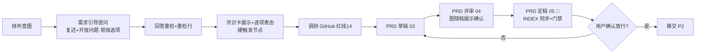

**P2 方案（06-09，决策型）**

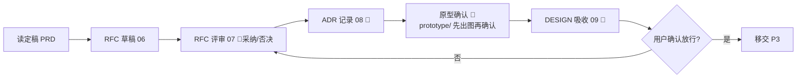

**P3 开发（10-11，执行型）**

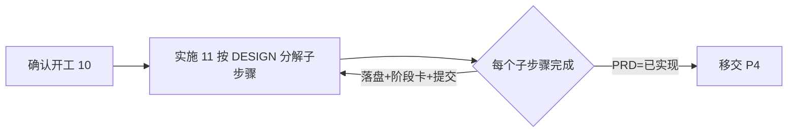

**P4 审计与验证（12-13，执行型）**

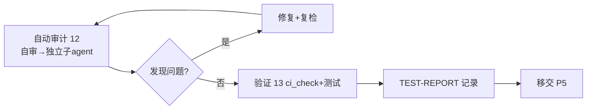

**P5 交付发布（14-16）**

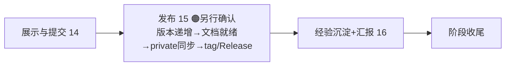

### 贯穿动作状态机（任意阶段可触发）

**文档更新（红线 13）**

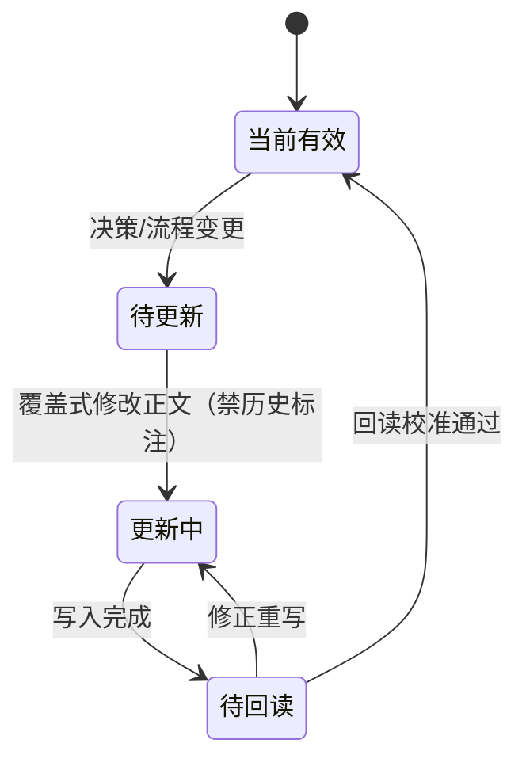

**STATUS 快照落盘**

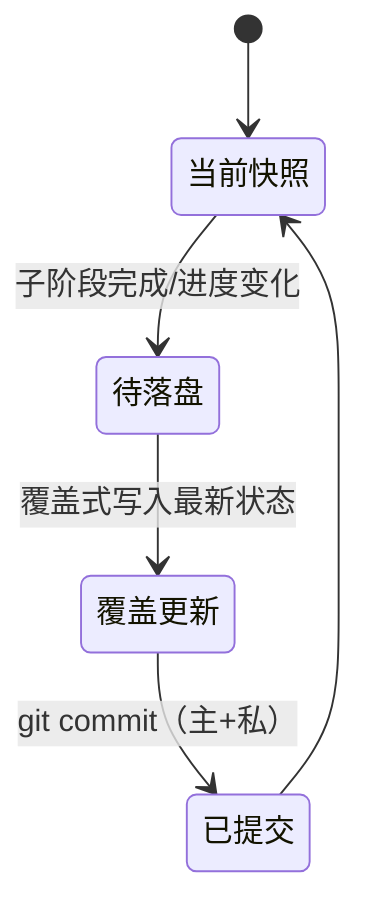

**审计（红线 4）**

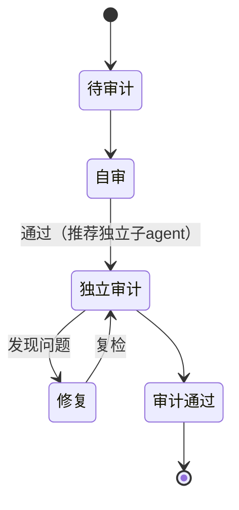

**经验沉淀**

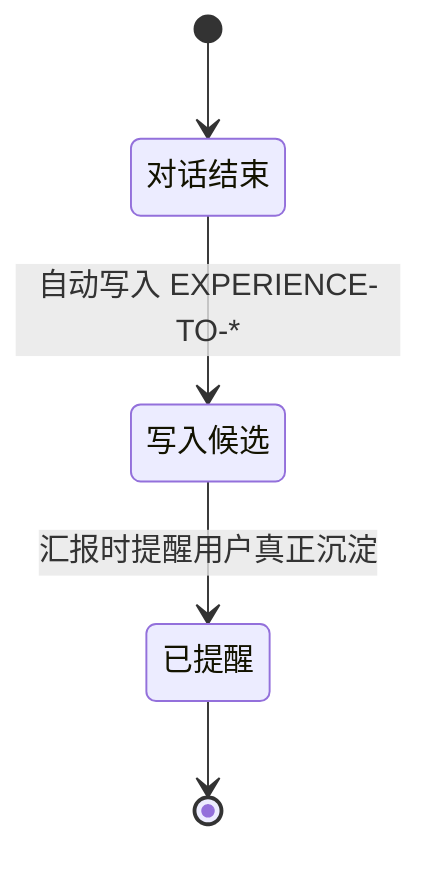

**删除归档（红线 5）**

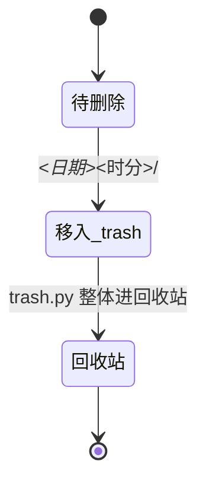

### 动作 → 归属映射（哪个动作在哪个阶段跑）

| 动作 | 主流程归属 | 贯穿可用 | 状态机 |
|---|---|---|---|
| 需求引导/调研/PRD | P1 | — | §6 需求引导 |
| RFC/ADR/原型/DESIGN | P2 | — | 登记册 |
| 实施 | P3 | — | 文档更新 |
| 审计/验证 | P4 | — | 审计 |
| 展示/发布/沉淀 | P5 | — | 发版（见发布流程）/ 经验沉淀 |
| 文档更新 | 任意阶段 | ✓ | 文档更新 |
| STATUS 落盘+提交 | 任意阶段 | ✓ | STATUS 快照落盘 |
| 删除归档 | 任意阶段 | ✓ | 删除归档 |

## 5. 阶段卡 = 合规检查点（D15）

<!-- FACT:stage-card -->

每次实质回复/落盘/恢复/收尾/询问进度时展示**合并紧凑阶段卡**（纯闲聊除外）。阶段卡
为一个模块：**标题（含状态）→ 横置阶段线 → 合规两行**为固定块，**共识卡为
决策型推进前固定块（红线 18）**；日常非关键节点仅输出一行**重检行**；
**阶段卡内一律使用中文名称，不显示字母缩写**（如 需求阶段/方案文档/架构决策记录/
状态快照；节点编号与文档编号等数字保留）。模板见 `dev/STATUS.md`。

```markdown
## 📍 阶段卡（<⏳ 进行中 · 等待确认 / ✅ 已完成>）

<阶段中文名>：<节点 01 中文名> → … → **<当前节点中文名>** → … → <节点 NN 中文名>

合规：
✓（已完成）：<合规项>；<合规项>
⏳（待完成）：<合规项>；<合规项>

> 反定型（条件块）：仅关键/风险节点展示；非关键节点省略本块。
> 📌 共识卡（决策型推进前固定块；硬触发节点必展示，红线 18）：
- 认知基线：<当前理解 + 我的假设 + 已确认共识>
- 缺口：<尚未确认 + 新浮现问题>
- 质疑：<反例 + 替代解释>
- 推进结论：<重新审视 + 本次需用户逐项表态项>
> 重检行（每次用户回答后）：重检：这条新信息改变了 X / 未改变 Y / 浮现新问题 Z。
```

- **阶段线**：横置展示**当前阶段全部节点**，当前所在节点**加粗**；标签为阶段中文名
  （需求阶段 / 方案阶段 / 开发阶段 / 审计验证阶段 / 交付发布阶段）。节点中文名映射
  见 §1（如 01 需求提出 → 05 需求文档定稿）。
- **合规**：生命周期合规清单压成两行——已完成（✓）一行、待完成（⏳）一行，项间用
  分号分隔。七项：文档同步（红线 13）/ 状态落盘（红线 15）/ 阶段提交（D14）/
  质量校验 / 阶段确认（决策型确认或执行型无反对）/ **红线遵循（本阶段相关红线
  已展示）** / 经验沉淀（红线 10）。
- **共识卡（固定块）**：红线 18 四项（认知基线 / 缺口 / 质疑 / 推进结论），以
  紧凑列表附内容（不是仅勾选）；**硬触发节点必展示**（需求方向调整 / 调研结论
  形成 / 定稿·采纳·放行前 / 验收标准变更 / 发现需求矛盾 / 范围变更）；
  非关键节点仅一行重检行。
- 阶段卡不再展示「正在完成 / 已完成 / 下一步」字段；进度细节见 STATUS「当前任务」。
- 决策型推进前，阶段卡附 **📌 共识卡**：四项内容 + 用户逐项表态（红线 18）。
<!-- /FACT -->

## 6. 需求引导方法论（P1 内嵌，D5）

<!-- FACT:req-guide -->

P1 第一步即「引导提问」（红线 18）：**先复述意图，再提发散性问题，引导用户发现
真正的需求**——用户未必清楚自己要什么，提问是帮用户「发现」，不只是把已想说的
「澄清」；未发现/未澄清前，禁止直接抛方案选项。

**逐层收敛策略**：按「痛点溯源（要解决什么问题）→ 阶段粒度（事情怎么拆）→
披露深度（信息展示多少）→ 恢复机制（中断怎么续）→ 切换节奏（怎么推进）」
逐层提问，从宽到窄收敛，直到需求明确。

**提问规则**：禁止问题面板/选择面板类 UI（仅聊天/文本提问并中止等待）；
聊天内可给选项/推荐（信息辅助）但不得仅依赖选项推进；用户回答 = 新信息输入
（非确认），每次回答后重检问题空间并输出一行**重检行**（「重检：这条新信息
改变了 X / 未改变 Y / 浮现新问题 Z」）；**硬触发节点**（需求方向调整 / 调研
结论形成 / 定稿·采纳·放行前 / 验收标准变更 / 发现需求矛盾 / 范围变更）必须
完整展示**共识卡**四项并获用户逐项表态；确认不锁定（需求阶段内新信息可回审，
PRD 定稿后变更走开新 PRD 取代）。

**流程**：倾听意图 → 发散性引导提问 → 逐层收敛（回答重检 → 重检行）→
共识卡展示（硬触发节点）→ 用户逐项表态 → 调研（红线 14）→ 需求明确。

**状态机**：

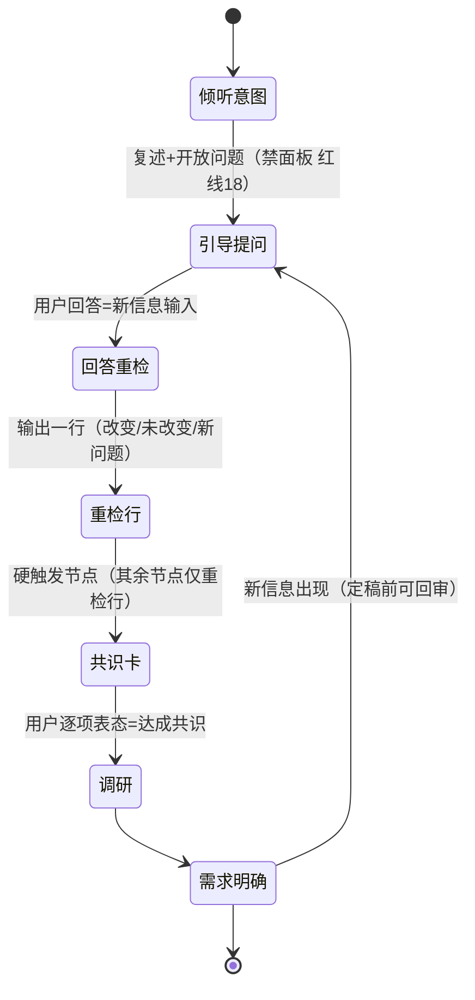
<!-- /FACT -->

## 7. 档位（S/M/L）与阶段裁剪

- **S 档**（小需求/修复/文档改动）：P1 简化（仅引导确认）直达 P3；关键决策仍可记 ADR；
- **M 档**：P1 全走（PRD 必需、RFC 可选、ADR 架构级必走）；
- **L 档**（新项目/架构级/技术栈选型）：P1+P2 全走（PRD + RFC + ADR 全必需）。

## 8. 阶段契约（必做项与裁剪属性）

<!-- FACT:stage-contract -->

- **动机**：「这一步必须做什么」曾散落多处、看不全；每节点集中一份契约，完成与否
  对一处即可核验；裁剪属性+替代动作让项目按需裁剪有章可循（受控跳过，不是
  随意跳）。

**每阶段必做硬性规范清单**：

| 阶段 | 必做项 | 裁剪属性 | 裁剪时的替代 |
|---|---|---|---|
| P1 需求 | ① 需求冲突检测（见下）② 需求引导（复述+澄清，§6）③ 立项类话题先调研（红线 14）④ PRD 定稿门禁（字段齐全） | 可裁剪-需替代（S 档） | S 档：仅引导确认；PRD 简化为一段需求描述+验收标准并登记 |
| P2 方案 | ① 方案候选对比供用户拍板 ② RFC/ADR/原型按档位执行 ③ DESIGN 吸收 ④ 涉及接口/数据/权限需求时：先定稿对应设计契约（接口契约须用户确认场景映射），契约放 `dev/design/` | 可裁剪-需替代（S 档整体；M 档部分） | S 档整体跳过；M 档 RFC 可选、架构级 ADR 不可省；原型裁剪须文字说明并获确认；设计契约按适用性裁剪（声明落设计总览） |
| P3 开发 | ① 确认开工（未获确认不实施）② 实施同步文档（红线 13）③ 按已冻结的设计契约实施；契约变更须重新经用户确认 | 不可裁剪 | — |
| P4 审计验证 | ① 自动审计（自审→独立审计）② 检查与测试并记录 | 可裁剪-需替代 | 轻量替代：只做自审清单（免独立复审），须声明并获用户确认；测试不可全免，至少冒烟 |
| P5 交付发布 | ① 发布流程七步（见发布流程）② 完成检查清单 | 不可裁剪 | — |

**裁剪规则（模块化自由组合）**：
- 项目启动时可按本表选择裁剪（档位 S/M/L 是预设组合，见 §7）；**执行中可随时
  裁剪，但每次必须用户确认**；
- 每次裁剪在 STATUS 快照登记**裁剪声明**：裁剪了哪个节点、为何可跳、用什么替代；
- 发布校验断言：被裁剪节点均有声明、声明与裁剪属性相符（「不可裁剪」节点
  不得出现裁剪声明）；
- 阶段卡上明示哪些节点已裁剪（展示面可见「本项目没做这一步，且已声明」）。

**需求冲突检测（P1 必做项①，防复发）**：
- 收到新需求时：对照**定案清单 + 红线 + 已有架构决策**检测，输出**冲突与影响面
  报告**（触及哪些定案、影响多大）；
- 有冲突：不得悄悄推进，须用户拍板（开新决策推翻旧定案，或调整新需求）；
- 需求定案后：再检测一次，确认定案不与既有体系打架；
- 动机：防止「上次改好、下次又变」——把漂移的入口拦在需求阶段。
<!-- /FACT -->

## 9. 本阶段实例（项目专用，随任务覆盖更新）

> 以下由 agent 在任务进行中按 STATUS.md 快照同步维护，本文件只保留阶段定义权威内容，
> 实例化状态一律放 `dev/STATUS.md`。
