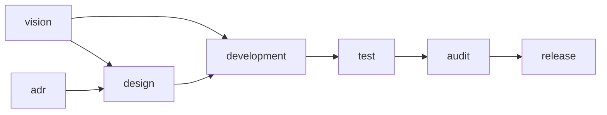

# AGENTS.md — skill 开发（使用规则）

> **适用范围**：本项目启用「skill 开发」spec 时，agent 承担 skill 开发任务
> 先读本文件判定入口、走路径。项目级总纲见仓库根 `AGENTS.md`。
>
> **本包内运转**：机制通则（spec 包结构、manifest / module.json 字段表、
> 状态灯、空值惯例、锁文件与冷启动校验）见模板框架 `spec/AGENTS.md`（出厂
> 即带）；「怎么造 / 改 spec 和模块」是构建规则，默认不读，需造 / 改时从
> 云端拉取 `build/`。

## 一、这个 spec 是什么

「skill 开发」场景的工作流，产出物是 agent skill（SKILL.md 及其
references / assets 等，具体形态项目自定）。skill 体量小，一个 idea 一次
就能开发完，没有排期与当期需求层——由 7 个模块按依赖链编排：
vision（想法池）→ design（方案）→ development（编写）→ test（实测）→
audit（审计）→ release（收口），adr（决策记录）横切全局。

## 二、依赖全景与入口

### 依赖全景（谁依赖谁）

箭头 =「上游 → 下游」（`vision --> design` 表示 design 依赖 vision）。

需求（这个 skill 做什么、做到什么程度）由协作段聊定，想法登记在 vision；
adr 横切（design 引用决策）。

依赖是必要而非充分条件，依赖文件是必需的，但是不代表只需要。

### 入口（启用哪些模块）

按「是否动需求 / 是否动方案 / 是否要发布」三个维度判定入口（入口可配置，
改 `manifest.json` 的 entries）：

| 入口 | 判定 | 启用的模块 |
| ---- | ---- | ---- |
| 小修 tweak | 不动需求、不动方案、不发布（错字 / 小 bug / 链接失效 / 措辞微调） | development |
| 完整开发路径 skill | 新写或改版一个 skill（完整走一遍） | vision + design + development + test + audit + release |

「启用的模块」是集合、不表顺序；执行顺序与依赖看上面的全景图。adr 横切、
不列入入口。路径外的模块不启用。入口判定拿不准时，先和用户对齐一句再动手。

## 三、控制权与检查点

工作流按控制权分两段，显式检查点只在**控制权交接**处设：

- **协作段**（vision / design / adr）：产出物是和用户反复讨论协作出来的，
  每一步都过用户的手，天然处处是确认，不设显式检查点。
- **自主段**（development → test → audit）：agent 全权连续执行，中间不打断
  （大问题例外，停下来回讨论，判据见 development 的规范）。

两个显式检查点：

1. **实施放行**（自主段入口）：方案聊定、agent 转全权执行前，向用户确认
   「就这么干」，确认后才进入 development。
2. **收口放行**（release 前）：发布 / 推送是不可逆动作，动手前必须征得
   用户同意（红线兜底，此处显式重申）。
