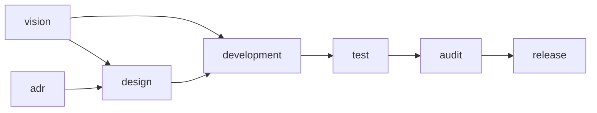

# skill 开发 — spec

> 使用场景：个人长期维护项目中开发 agent skill——产出物是 skill（`SKILL.md`
> 及其 references / assets 等，具体形态项目自定）。
>
> 版本 0.1.0（云端货架版本；拉进项目后自由改，本地以 git 为准）。
>
> 项目级总纲见仓库根 `AGENTS.md`；spec 机制通则（spec 是什么、怎么拉、
> 怎么读、状态灯约定）见模板框架 `spec/AGENTS.md`。

## 一、这套工作流

「skill 开发」场景。skill 体量小、一个 idea 一次就能开发完，**没有排期与
当期需求层**（故不设 prd 阶段），由 7 个阶段编排，推荐推进顺序：

vision（想法池）→ design（方案）→ development（编写）→ test（实测）→
audit（审计）→ release（收口）；adr（决策记录）横切全局。

## 二、概览

### 全景

箭头 =「上游 → 下游」（`vision --> design` 表示 design 在 vision 之后）。
需求（这个 skill 做什么、做到什么程度）由协作段聊定，想法登记在 vision；
adr 横切（design 会用到决策）。箭头顺序是推荐的阶段顺序，并不强制，可以
根据实际情况进行调整。

**回溯线（改了上游往下查）**：改动某阶段的产出后，沿全景图箭头往下逐一
核查所有下游阶段是否受影响、要不要跟着改（如改了 vision → 回看 design →
development → test → audit → release）；查多深以「下游是否用到被改的
内容」为准，用到了就需要纳入任务进行核查和调整。

### 入口（流程调节：不同大小的任务走不同档）

按「是否动需求 / 是否动方案 / 是否要发布」三个维度判定入口：

| 入口 | 判定 | 启用的阶段 |
| --- | --- | --- |
| tweak 小修 | 不动需求、不动方案、不发布（错字 / 小 bug / 链接失效 / 措辞微调） | development |
| skill 完整开发路径 | 新写或改版一个 skill（完整走一遍） | vision + design + development + test + audit + release |

「启用的阶段」是集合、不表顺序；执行顺序参考上面的全景图。adr 横切、
不列入入口。路径外的阶段不启用。入口判定拿不准时，先和用户对齐再动手。

### 控制权与检查点

工作流按控制权分两段，显式检查点只在**控制权交接**处设：

- **协作段**（vision / design / adr）：产出物是和用户反复讨论协作出来的，
  每一步都过用户的手，天然处处是确认，不设显式检查点。
- **自主段**（development → test → audit）：agent 全权连续执行，中间不打断
  （大问题例外，停下来回讨论，判据见 development 阶段）。

两个显式检查点：

1. **实施放行**（自主段入口）：方案聊定、agent 转全权执行前，向用户确认
   「就这么干」，确认后才进入 development。
2. **收口放行**（release 前）：发布 / 推送是不可逆动作，动手前必须征得用户
   同意（红线兜底，此处显式重申）。

## 三、各阶段

### vision — 想法池

- **产出**：`context/vision.md`（想法池；实例化参考 `assets/vision-template.md`，
  仅参考格式，内容由项目自行实现）。
- **运行过程**：
  1. 接住想法——用户丢来一个 skill idea（可能一句、可能模糊），先复述确认
     理解，不急着落盘；
  2. 引导澄清——用开放、发散问题聊清这个 skill 给谁用、解决什么、做到什么
     程度算好，没说清的显式标「未定」，不替用户脑补；
  3. 入池——聊定的想法登记进 `context/vision.md` 想法池，要做时从池里挑
     一个进入 design / development；
  4. 及时落盘，只留想法现状、不留历史。
- **规范 / 边界**：只记想法与方向、不写死方案；未定的事显式标「未定」。
  skill 体量小，**无排期层、无近三期排期表**；不管方案、技术选型。

### design — 方案与设计

- **产出**：`context/design/`——`design.md`（方案主体）+ 按需图纸（实例化参考
  `assets/design-template.md`）。
- **运行过程**：
  1. 写方案——读想法和已有决策，和用户讨论，把这个 skill 怎么做（结构、
     references / assets 拆分、触发描述怎么写）组织成一份方案写进 `design.md`
     （skill 简单到脑子装得下就不写方案）；
  2. 画图——方案里复杂的地方按需画图细化，常用几种（架构图 / 关键流程走查
     等），不限于此、需要什么画什么，画完及时向用户展示与讲解；
  3. 活文档——开发中发现方案不对，直接改（历史交给 git）。
- **规范 / 边界**：方案是整体、决策是散点（`design.md` 把决策组织成整体方案）；
  文件类型优先选用户可直接打开查看的（html / markdown / jpg 等），需中间格式
  （svg / canvas 等）时原始中间格式文件也保留；图纸按需取用、不预先生成用不到
  的图。不管需求。

### adr — 决策记录（横切）

- **产出**：`context/adr/`——`decisions.md`（当前仍有效的决策，实例化参考
  `assets/decisions-template.md`）+ `history.md`（被取代的决策，默认不读）。
- **运行过程**：
  1. 决策及时记录——在对话中确定一个重要决策后，马上写进 `decisions.md`
     顶部；
  2. 过程归讨论记录——选路的对比过程（比了哪些路、当时怎么想）写进
     `archive/discussion/`，不写进 `decisions.md`；
  3. 取代——每次写入时回读全文，发现决策重复或被推翻时，从 `decisions.md`
     整段移出、记入 `history.md` 顶部，加一行「何时被何取代」，旧文不涂改。
- **规范 / 边界**：`decisions.md` 只放当前仍有效的决策，新决策写在最上面；
  被推翻的决策不删、写入 `history.md`（默认不读，追溯时才翻）。不管需求、方案
  整体组织。

### development — 开发执行（编写）

- **产出**：`workspace/src/`（skill 产物：`SKILL.md` 及其 references /
  assets 等，按任务逐步产出，无模板可实例化）+ `process/goal.md`（本次目标）。
- **运行过程**：
  1. 定目标——读相关文档，和用户讨论定出这次开发的目标，写进
     `process/goal.md`；
  2. 拆任务——把目标拆成任务，记到 `process/task.md`；
  3. 开发——得到用户确认后根据目标 + task.md 全权执行，当期任务一次性做完，
     过程中及时自测；
  4. 反馈——小问题记下继续、做完统一反馈，大问题（耦合高 / 影响广 / 根基有
     问题）停下来回讨论；
  5. 及时更新 task 状态，任务完成后告知用户完成了哪些、有哪些需 review，
     需要留验收凭据时在 `process/` 根写 `review-<简介>.md`（临时件）；用户
     确认通过后 agent 及时删除该 review 件（历史交给 git）、goal.md 归档
     `archive/goal/`。
- **规范 / 边界**：小问题随做随记（记在任务板），做完统一记 review 并反馈；
  大问题判据——耦合高、影响广、根基有问题，停下来回讨论；git 提交信息遵循
  Conventional Commits（feat / fix / docs 等）。不管审查、发布。

### test — 测试与验收（实测）

- **产出**：`context/test/`——每次一份 `TEST-NNNN.md`（测试用例 + 测试结果，
  实例化参考 `assets/test-template.md`）。
- **运行过程**：
  1. 整理用例——开发完，根据验收标准 + skill 产物整理这次的测试用例（skill
     的实测重点是真的按触发条件调用一遍、看行为是否符合预期）；
  2. 按用例测——按测试用例跑，记录结果（过 / 不过 / 用户兜底）；
  3. 用户兜底——agent 测不了的交给用户，实际用一遍算真做完；
  4. 归档——这次测完，测试文档原地归档、默认不删除，下次新开一份。
- **规范 / 边界**：小修免全套；用例从需求的验收标准来、不凭空造。不管审查、
  发布。

### audit — 审计

- **产出**：审计报告（作为 review 临时件走验收，落 `process/` 根
  `review-<简介>.md`）；验收通过后删除（历史交给 git）。
- **运行过程**：
  1. 自审——先查一遍密钥是否外泄、有没有做需求外的东西、文档内部是否
     自洽；
  2. 独立查——换一个不带开发记忆的独立 agent 再次进行对抗式审查；
  3. 输出报告——写审计报告、附审计结论，放行或打回，隐患列清单、修复后
     再查。
- **规范 / 边界**：查工程卫生、不查产品行为（产品行为归功能验证）；对抗性——
  假设有问题、主动找证据推翻「做完了」的宣称；**skill 开发重点审文档**（描述
  是否准确、触发条件是否清晰、references 是否对得上）。不管发布。

### release — 收口

> 本阶段是占空自实现（self_implemented）：云端给骨架、项目自填收口做法。

- **产出**：交付物落 `workspace/dist/`；变更日志写 `workspace/CHANGELOG.md`
  （给用户的版本日志，随发布）。
- **运行过程**：
  1. 写 CHANGELOG——把这次做了什么写进 `workspace/CHANGELOG.md`；
  2. 确认收口方式——私有项目本地打 tag、本地安装即发布，公开项目上传
     GitHub；
  3. 不可逆动作动手前，把方案明说、征得用户同意。
- **规范 / 边界**：收口是项目自定义的，模板只留位子、具体怎么做每个项目自己定；
  发布 / 推送是不可逆动作，动手前必须征得同意。不管开发、测试、审查，也不管
  不更新用户版本号的小修改。
