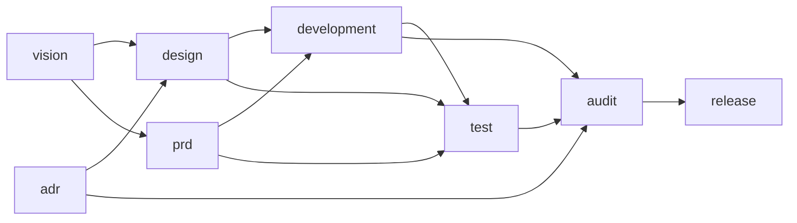

# AGENTS.md — 软件开发 spec（使用规则）

> **适用范围**：本项目启用「软件开发」spec 时，agent 承担开发任务先读本文件
> 判定入口、走路径。项目级总纲见仓库根 `AGENTS.md`。
>
> **本包内运转**：机制通则（spec 包结构、manifest / module.json 字段表、
> 状态灯、空值惯例、锁文件与冷启动校验）见模板地基 `spec/AGENTS.md`（出厂
> 即带）；「怎么造 / 改 spec 和模块」是构建规则，默认不读，需造 / 改时从
> 云端拉取 `build/`。

## 一、这个 spec 是什么

「软件开发」场景的工作流，由 8 个模块按依赖链编排：

- vision（愿景与排期）→ design（方案与设计）→ prd（当期需求）→
  development（开发执行）→ test（测试与验收）→ audit（审计）→ release（收口）；
  adr（决策记录）横切全局。

## 二、依赖全景与入口

### 依赖全景（谁依赖谁）

箭头 =「上游 → 下游」（`vision --> design` 表示 design 依赖 vision）。

prd 与 design 并行（都只依赖 vision），adr 横切（design、audit 都依赖它）。

依赖是必要而非充分条件，依赖文件是必需的，但是不代表只需要。

### 入口（启用哪些模块）

按「是否动需求 / 是否动设计 / 是否要发布」三个维度判定入口（入口可配置，改
`manifest.json` 的 entries）：

| 入口          | 判定                             | 启用的模块                                                        |
| ----------- | ------------------------------ | ------------------------------------------------------------ |
| 微调 tweak    | 不动需求、不动设计、不发布（错字 / 小 bug / 样式） | development                                                  |
| 小功能 feature | 动需求、不动架构、不发布（一个明确小功能）          | prd + development + test                                     |
| 一期 phase    | 动排期、可能动设计、要发布（完整一期）            | vision + design + prd + development + test + audit + release |

「启用的模块」是集合、不表顺序；执行顺序与依赖看上面的全景图。adr 横切、
不列入入口。路径外的模块不启用。入口判定拿不准时，先和用户对齐一句再动手。
